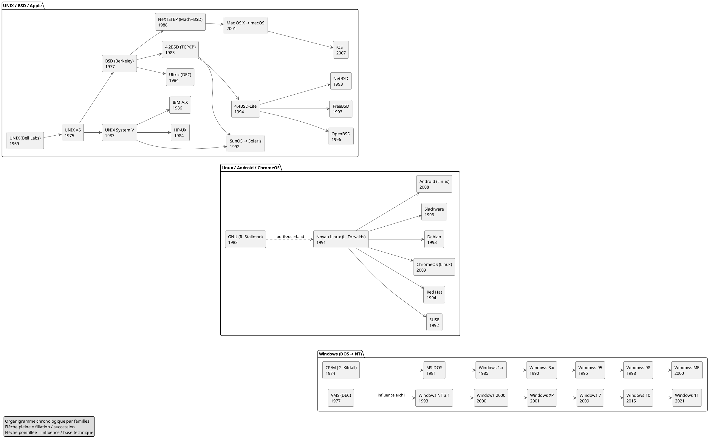

# **Histoire des systèmes d’exploitation modernes (1969 → 2025)**

## **Chapitre 1 - La naissance d’UNIX (1969-1975)**

L’histoire des systèmes d’exploitation contemporains trouve son point de départ à la fin des années 1960, dans les laboratoires Bell d’AT&T. En 1969, deux chercheurs, **Ken Thompson** et **Dennis Ritchie**, conçoivent un système d’exploitation expérimental sur un mini-ordinateur PDP-7. Ce système, baptisé **UNIX**, cherchait à offrir un environnement simple, cohérent et multi-utilisateur. L’idée fondatrice était que « tout est fichier » : les périphériques, les données et les processus eux-mêmes pouvaient être manipulés avec la même logique. Cette vision, associée à l’esprit d’ingénierie créative des laboratoires Bell, donna naissance à une architecture élégante et durable.

Vers 1972-1973, Dennis Ritchie crée le langage **C**, spécialement pour réécrire UNIX. Cette réécriture est décisive. Elle rend le système portable et adaptable. UNIX n’est plus lié à un seul modèle de machine, il peut désormais migrer. C’est cette portabilité qui explique en grande partie son héritage immense.

---

## **Chapitre 2 - La diffusion universitaire et l’émergence de BSD (1975-1985)**

Au milieu des années 1970, les laboratoires Bell commencent à diffuser UNIX vers les universités, sous licence de recherche. L’Université de Californie à Berkeley devient rapidement un centre majeur d’innovation. Un étudiant particulièrement doué, **Bill Joy**, améliore UNIX en ajoutant notamment l’éditeur de texte vi et le C-shell. Les chercheurs de Berkeley intègrent également le réseau, en particulier la **pile TCP/IP**, qui deviendra par la suite la base d’Internet.

À partir de là, UNIX existe sous deux grandes branches :  
la branche commerciale d’AT&T, appelée **System V**, et la branche universitaire, appelée **BSD** pour Berkeley Software Distribution.

Au cours des années 1980, d’importantes entreprises adoptent et modifient UNIX. Sun Microsystems commercialise **SunOS** puis **Solaris**, IBM développe **AIX**, Hewlett-Packard propose **HP-UX**, Digital Equipment Corporation crée **Ultrix**. De son côté, Berkeley publie en 1983 **4.2BSD**, qui intègre TCP/IP et devient le socle de l’Internet académique puis mondial.

Cependant, un long conflit juridique entre AT&T et la communauté BSD ralentit l’évolution du système jusqu’à un accord en 1994, qui permet la publication de **BSD 4.4-Lite**, base libre et réutilisable. C’est de cette base que naîtront **FreeBSD**, **NetBSD** et **OpenBSD**, qui existent encore aujourd’hui.

---

## **Chapitre 3 - L’ère des micro-ordinateurs : CP/M, MS-DOS et les premières versions de Windows**

Pendant ce temps, une autre histoire se déroule dans le monde des ordinateurs personnels. En 1974, **Gary Kildall** développe **CP/M**, un système pour micro-ordinateurs 8 bits. Dans les années 1980, Microsoft rachète puis adapte un système similaire appelé QDOS, qui devient **MS-DOS** en 1981. Sur MS-DOS, Microsoft construit petit à petit une interface graphique appelée **Windows**.

Les premières versions de Windows, entre 1985 et 1993, ne sont en réalité que des environnements graphiques posés sur DOS. **Windows 95, 98 et ME** héritent encore de cette base. Il s’agit d’une lignée totalement séparée de celle d’UNIX.

---

## **Chapitre 4 - L’architecture Windows NT : héritage de VMS**

Microsoft comprend vite que cette architecture héritée de MS-DOS n’est pas adaptée aux réseaux et aux machines multiprocesseurs naissants. Pour créer un système plus solide, la firme recrute **Dave Cutler**, l’architecte du système **VMS** chez Digital. Il conçoit le noyau **Windows NT**, publié en 1993.

De Windows NT dériveront **Windows 2000**, puis **Windows XP**, **Windows 7**, **Windows 10** et **Windows 11**.  
Contrairement à ce que l’on pourrait croire, **Windows NT n'est pas descendant d’UNIX**, mais il adopte progressivement des compatibilités (notamment via **POSIX**) afin de faciliter l’interopérabilité.

---

## **Chapitre 5 - La révolution du logiciel libre : GNU et la licence GPL**

Pendant que les versions commerciales d’UNIX dominent les serveurs et que Windows s’impose sur les postes personnels, une révolution éthique et technique se prépare. En 1983, **Richard Stallman** lance le projet **GNU**, dont l’objectif est de créer un système libre. La **licence GPL**, publiée en 1989 puis révisée en 1991, garantit juridiquement quatre libertés fondamentales : utiliser, étudier, modifier et redistribuer.

GNU publie l’éditeur Emacs, le compilateur GCC, puis de nombreuses bibliothèques.  
Mais il manque encore un noyau fonctionnel.

---

## **Chapitre 6 - La naissance de Linux et l’explosion des distributions (1991-2000)**

En 1991, **Linus Torvalds**, étudiant finlandais, publie le premier noyau **Linux**. En l’associant aux outils GNU, on obtient un système complet : **GNU/Linux**. Ce système, libre et modifiable, se diffuse extrêmement vite grâce à Internet et au travail collaboratif.

Des distributions organisées émergent : **Debian**, **Red Hat**, **Slackware**, **SUSE**.  
À la fin des années 1990, Linux devient un acteur majeur des serveurs web.  
L’architecture **LAMP** (Linux, Apache, MySQL, PHP/Perl/Python) devient la base de l’Internet dynamique.

---

## **Chapitre 7 - La guerre ouverte : Microsoft contre Linux (1998-2013)**

La montée en puissance de Linux entraîne un conflit stratégique majeur. Sous la direction de **Steve Ballmer**, Microsoft considère la licence GPL comme une menace pour son modèle économique. En 2001, Ballmer déclare publiquement : **« Linux est un cancer »**.

La période 1998 à 2013 est marquée par :

- des campagnes publicitaires agressives contre Linux,

- des accusations de violation de brevets,

- l’affaire **SCO**, qui tente de contester juridiquement la légalité de Linux, sans succès.

Durant cette période, Linux continue néanmoins de gagner du terrain dans les serveurs, les supercalculateurs et les infrastructures réseau.

---

## **Chapitre 8 - La renaissance d’Apple : de NeXTSTEP à macOS et iOS**

Pendant ces années, Apple vit sa propre transformation. Après son éviction, **Steve Jobs** fonde NeXT et développe **NeXTSTEP**, basé sur un micro-noyau Mach et des composants BSD.

Quand Apple rachète NeXT en 1997, Jobs revient et transforme l’ancien Mac OS en un système moderne basé sur NeXTSTEP : ce sera **Mac OS X** en 2001, devenu **macOS**.  
En 2007, Apple réutilise cette même base pour créer l’iPhone, donnant naissance à **iOS**, puis à ses variantes (iPadOS, watchOS, tvOS).

Les systèmes Apple modernes appartiennent donc **à la famille UNIX**, avec un contrôle strict de la distribution logicielle.

---

## **Chapitre 9 - L’avènement du mobile : Android et la domination de Linux**

En 2008, Google lance **Android**, basé sur le noyau Linux mais avec un environnement logiciel distinct. Android devient rapidement le système d’exploitation mobile le plus utilisé au monde, porté par une multitude de constructeurs.

Linux, qui n’avait jamais dominé les PC domestiques, s’impose finalement **sur les téléphones**, l’outil informatique le plus répandu.

---

## **Chapitre 10 - Le retournement de Microsoft : de l’hostilité à la coopération (2014 → 2025)**

À partir de 2014, **Satya Nadella** devient directeur général de Microsoft. Il comprend que la croissance se situe dans le **cloud**, où **Linux est omniprésent**. Microsoft change alors radicalement de stratégie.

L’entreprise publie **Visual Studio Code** sous licence MIT, ouvre **PowerShell**, apporte **.NET Core** à Linux, propose **SQL Server** pour Linux, puis introduit **WSL** (Windows Subsystem for Linux).  
En 2016, Microsoft devient membre de la **Linux Foundation**.

L’ancien ennemi devient un partenaire.  
L’opposition idéologique laisse place à l’interopération pragmatique.

---

## **Chapitre 11 - Situation en 2025 : une cohabitation stabilisée**

Aujourd’hui, Linux domine les **serveurs**, les **supercalculateurs**, les **infrastructures cloud**, les **conteneurs**, et les **smartphones via Android**.  
macOS et iOS occupent une position forte dans les environnements créatifs et mobiles haut de gamme.  
Windows continue de dominer le poste de travail professionnel, mais s’appuie désormais sur l’interopérabilité avec Linux.

Deux grandes lignées ont ainsi fini par coexister :  
la **famille UNIX** (BSD, Linux, macOS, Android) et la **famille VMS → Windows NT**.

## **Annexe : Visualiser l’arbre historique des systèmes d’exploitation**

Pour bien comprendre l’évolution des systèmes d’exploitation (UNIX, BSD, Linux, macOS, Android, Windows), nous allons manipuler un **organigramme d’histoire** sous forme de **diagramme PlantUML**

#### **Qu’est-ce que PlantUML ?**

**PlantUML** est un outil qui permet de créer des **schémas et diagrammes** (organigrammes, frises, diagrammes UML, etc.) **à partir de texte**.  
Il suffit d’écrire une description simple en langage proche de l’anglais, et PlantUML génère automatiquement l’image correspondante.  
C’est un outil très pratique pour **visualiser des concepts techniques**, garder des documents **clairs**, et permettre une **reproduction exacte** du schéma.

### **1) Ouvrir l’éditeur PlantUML en ligne**

Cliquez sur ce lien :

➡️ [PlantUML Web Server](https://www.plantuml.com/plantuml)

Aucun logiciel n’est nécessaire, tout se fait dans le navigateur.

---

### **2) Copier / Coller le code PlantUML**

 **Copiez l’intégralité de ce script puml**.

Collez-le dans la fenêtre de script du site PlantUML.

Le site génère automatiquement **un diagramme** dont vous pourrez changer le thème visuel.

---

### **3) Observer la structure**

Dans ce diagramme, vous trouverez :

- La famille **UNIX → BSD → macOS / iOS**

- La famille **GNU + Linux → distributions + Android / ChromeOS**

- La famille **CP/M → MS-DOS → Windows → Windows NT → Windows 11**

- Et les **liens d’influence entre lignées**

**Important :**

- **Flèches pleines** = filiation directe / descendance technique

- **Flèches pointillées** = influence historique (idées, architecture, concepts)

Prenez le temps d’**identifier les embranchements**.

---

### **4) Comparer avec l’arbre officiel de Wikipédia**

Maintenant, ouvrez la page suivante :

https://fr.wikipedia.org/wiki/Berkeley_Software_Distribution

Cet article de wikipedia traite de la famille des UNIX BSD et montre **l’arbre historique officiel des systèmes UNIX**.
