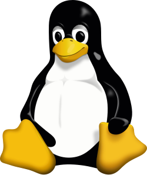

## **1. L’histoire de Linux**

L’histoire de Linux est étroitement liée à **deux mouvements complémentaires** :
d’un côté, l’**idée de liberté logicielle** défendue par **Richard Stallman**,
et de l’autre, la **réalisation technique d’un noyau libre** par **Linus Torvalds**.

Ces deux parcours vont finir par **se rejoindre** et donner naissance à ce que l’on appelle aujourd’hui :
**GNU/Linux**, que l’on appelle plus simplement *Linux* dans le langage courant.

### **1.1 Avant Linux : UNIX et le monde académique**

Dans les années 1970, l’informatique est dominée par les grands systèmes Unix, développés dans les laboratoires Bell (AT&T). Unix est alors **un système puissant, multitâche, multiutilisateur**, mais aussi **onéreux** et soumis à des **restrictions de distribution**.
Les universités, notamment **Berkeley**, en créent des variantes, dont BSD, très influente dans le monde de la recherche et de l’Internet naissant.

Cependant, à la fin des années 1970, ces systèmes restent **propriétaires**, c’est-à-dire **non-modifiables et non-partageables** par les utilisateurs.

### **1.2 Richard Stallman, le libre et le projet GNU (1983)**


En 1983, **Richard Stallman**, chercheur au MIT, lance le projet **GNU**.
Son idée est simple et révolutionnaire :

> **Créer un système d’exploitation entièrement libre**, c’est-à-dire modifiable, étudiable, copiable et partageable par tous.

Stallman définit **quatre libertés fondamentales** du logiciel libre :

1. **Utiliser** le logiciel comme on le souhaite,
2. **Étudier** son fonctionnement,
3. **Modifier** le logiciel,
4. **Partager** le logiciel et ses améliorations.

Pour garantir ces libertés, il crée la **licence GPL (General Public License)** en 1989.
Cette licence garantit que **tout logiciel libre le reste**, même après modification.

Le projet GNU développe rapidement :

* l’éditeur **Emacs**,
* le compilateur **GCC**,
* la bibliothèque standard **glibc**,
* de nombreux outils Unix indispensables.

Mais il **manque encore une pièce** :
le **noyau**, c’est-à-dire **le cœur** du système.

### **1.3 La rencontre déterminante : Linus Torvalds (1991)**



En 1991, **Linus Torvalds**, un étudiant finlandais de 21 ans, souhaite avoir un système Unix-like libre pour étudier et comprendre son fonctionnement.
À cette époque, les solutions libres existantes sont limitées, et Unix commerciaux sont hors de prix.

Il décide donc d’écrire **son propre noyau**, comme exercice personnel.

Le 25 août 1991, il publie un message désormais historique sur un forum :

> « Je crée un système d’exploitation libre, juste pour m’amuser.
> Il ne sera probablement jamais professionnel. »

Ce noyau s’appelle **Linux**.

Très vite, les développeurs du monde entier commencent à proposer des améliorations.
Linus accepte volontiers les contributions :
Linux devient **un projet collaboratif mondial**.

### **1.4 GNU + Linux = GNU/Linux**

En combinant :

* le **noyau Linux**, créé par Linus Torvalds,
* les **outils GNU**, créés par Richard Stallman et la FSF,

on obtient un **système d’exploitation complet**.

Ce système est appelé **GNU/Linux** dans un sens historique,
mais dans l’usage courant, on parle simplement de **Linux**.

### **1.5 L’essor des distributions Linux (1993 → 2010)**

Dès 1993, plusieurs groupes organisent Linux sous forme de **distributions**, c’est-à-dire :

* un noyau Linux
* * des outils GNU
* * des programmes prêts à installer
* * un gestionnaire de logiciels

Parmi les plus importantes :

| Distribution  | Année | Particularité                                 |
| ------------- | ----- | --------------------------------------------- |
| **Slackware** | 1993  | première distribution Linux stable            |
| **Debian**    | 1993  | projet communautaire durable, très stable     |
| **Red Hat**   | 1994  | orientée entreprises                          |
| **SUSE**      | 1994  | popularisée en Europe, héritière de Slackware |

Puis arrivent :

| Distribution   | Année | Particularité                                 |
| -------------- | ----- | --------------------------------------------- |
| **Ubuntu**     | 2004  | orientée simplicité utilisateur               |
| **Linux Mint** | 2006  | expérience utilisateur encore plus accessible |
| **Arch Linux** | 2002  | minimaliste, personnalisable                  |
| **Fedora**     | 2003  | version communautaire de Red Hat              |

→ **C’est ici que se situe Linux Mint**, la distribution que nous utiliserons en formation.

### **1.6 Linux conquiert le monde (2000 → 2025)**

Contrairement à Windows, Linux **ne devient pas dominant sur le poste de travail** à domicile.
Mais il devient **le système numéro 1 partout ailleurs** :

* **Serveurs web** (Apache, Nginx, PHP…)
* **Bases de données** (MySQL, PostgreSQL, MariaDB…)
* **Supercalculateurs** (plus de 99 % fonctionnent sous Linux)
* **Cloud computing** (AWS, Microsoft Azure, Google Cloud)
* **Objets connectés**
* **Voitures**
* **Et surtout… les smartphones**

En 2008, Google lance **Android**, basé sur **le noyau Linux**.
Android devient le système mobile le plus utilisé au monde.

Ainsi, en 2025 :

> **La majorité des ordinateurs en activité dans le monde utilisent Linux**,
> mais la plupart des utilisateurs ne le savent pas.

### **1.7 Bilan**

* **Stallman** apporte **la philosophie et les outils** (GNU, GPL).
* **Torvalds** apporte **le noyau et le modèle collaboratif ouvert**.
* **Les distributions** rendent Linux accessible et installable.
* **Le monde moderne (cloud & mobile)** repose sur Linux.

Linux est donc **le résultat d’un mouvement culturel, technique et social** :
la **coopération mondiale** autour du code et de la connaissance partagée.

---

## **2. Panorama des distributions GNU/Linux**

Les distributions Linux sont nombreuses et variées.  
Elles se distinguent principalement par :

- leur gestionnaire de paquets (APT, RPM, Pacman, etc.),

- leur objectif (débutant, serveur, sécurité, minimaliste, etc.),

- leur environnement graphique (Gnome, KDE, XFCE, Cinnamon…).

Nous utiliserons **Linux Mint**, issue de **Ubuntu**, elle-même issue de **Debian**.

Voici l’arbre complet historique des distributions Linux :

 https://upload.wikimedia.org/wikipedia/commons/1/1b/Linux_Distribution_Timeline.svg

---

## **3. Installation d’un environnement Linux Mint**

### **Préparation**

1. **Demandez au formateur** la clef USB contenant l’image d’installation (ISO) de Linux Mint.

2. Démarrez l’ordinateur **en bootant sur la clef USB**.
   
   - Au démarrage, pressez généralement : `F2`, `F10`, `F12`, `DEL`, `ESC` (selon modèle).

3. Sélectionnez la clef USB dans le menu de démarrage.

### **Mode Live**

Vous arrivez sur un bureau **sans installation** :  
→ Cela permet de tester Linux avant de l’installer.

### **Installation**

1. Cliquez sur **Install Linux Mint**.

2. Choisissez :
   
   - **Langue** : Français
   
   - **Clavier** : Français Alt

3. Cochez : **Installer les logiciels tiers** (codecs).

4. Cochez : **Effacer le disque et installer Linux Mint** (PC dédié)

5. Choisissez le fuseau horaire.

6. Choisissez un **nom d’utilisateur** + **mot de passe**(suffisamment complexe).

7. Choisissez : **Demander le mot de passe à l'ouverture de session**

8. Laissez l’installation se dérouler puis **redémarrez**. Vous serez invité à débrancher votre support (Clef USB) d'installation et à presser `Èntrée` pour redémarrer la machine.

Vous disposez maintenant d’un système Linux prêt pour le développement.

Avant toute chose, afin de ne pas perdre trop de temps dans des téléchargements interminables, il peut être pratique de changer la localisation des serveurs de mise à jour pour les dépôts de Ubuntu et Mint. Pour cela dans le menu démarrer ouvrez la logithèque, et dans le menu des options de l'interface sélectionnez : **Sources de logiciels**. Dans le premier menu **Dépôts officiels** changez le serveur **Principal (zara)** pour les dépôts de Mint et **Base (noble)**  pour les dépôts Ubuntu. Laissez les dépôts se recharger et fermez l'interface.

Il ne vous reste plus qu'à ouvrir un terminal ( `Ctrl` + `Alt` + `T`) et entrer les commande suivantes :

```bash
sudo apt update
```

cette commande va mettre à jour la liste des dépots et mises à jour disponibles.

Saisissez votre mot de passe administrateur tel que demandé puis entrez cette commande

```bash
sudo apt upgrade
```

Cette commande va mettre votre système à jour cela va prendre un peu de temps. Enfin, afin de charger les mises à jours du système, voici la commande vous permettant de rebooter votre système :

```bash
sudo reboot now
```

---

## **4. Configuration automatique de l’environnement**

Une fois l’installation terminée :

1. Ouvrez un terminal  
   (Menu → Terminal ou `Ctrl` + `Alt` + `T`)

2. Téléchargez le script d’installation :

```
wget https://github.com/RegameyManuel/Mint-Install-Script/blob/main/Install_Mint_22_stable.sh
```

3. Donnez les droits d’exécution :

```
chmod +x Install_Mint_22_stable.sh
```

4. Exécutez-le :

```
./Install_Mint_22_stable.sh
```

### Un script sh (en bash) pour faire quoi ?

Ce script automatise entièrement l’installation d’un **environnement de développement web complet** sur Linux Mint 22 (base Ubuntu 24.04).
Il configure à la fois les **outils système**, la **pile LAMP**, et les **outils de développement modernes**.

Il installe notamment :

#### **1) Les outils système et essentiels pour le développement**

* `build-essential` (compilateur GCC, make, outils de construction)
* `git` (gestion de versions)
* `curl`, `wget` (transferts réseau)
* `zip`, `unzip` (archives)
* `gnupg`, `ca-certificates` (sécurité et signatures)
* `software-properties-common`, `lsb-release`, `apt-transport-https` (gestion de dépôts)

→ **La machine devient prête à compiler, cloner et installer des projets.**

#### **2) La pile LAMP complète**

* Serveur web **Apache2**, activé et démarré automatiquement

* Base de données **MariaDB**, activée au démarrage

* PHP + modules nécessaires :
  
  * `php-cli`
  * `php-fpm` (option disponible)
  * `libapache2-mod-php`
  * `php-mysql`, `php-xml`, `php-mbstring`, `php-gd`, `php-curl`, `php-zip`

→ **Prêt à exécuter Symfony, Laravel, WordPress, Moodle, Nextcloud, etc.**

#### **3) Les outils de développement applicatif**

* **Symfony CLI** (pour créer, lancer et déboguer des apps Symfony)
* **Composer**, installé avec vérification de signature SHA-384
* **DBeaver CE** (client graphique pour MariaDB, PostgreSQL, etc.)

→ **Environnement professionnel, prêt pour le développement web moderne.**

#### **4) Configuration et optimisation**

* Définition automatique du **fuseau horaire PHP** (Europe/Paris)

* Augmentation de :
  
  * `memory_limit → 512M`
  * `upload_max_filesize → 64M`
  * `post_max_size → 64M`
  * `max_execution_time → 120s`

* Redémarrage automatique d’Apache pour prendre en compte la configuration

Ainsi l'utilisation de ce script permet d'installer un environnement **standardisé**, **fiable**, et **reproductible** pour quasiment tous les projets du module ! 

Il ne vous manque qu'à installer votre IDE (VSCode ?) ...
