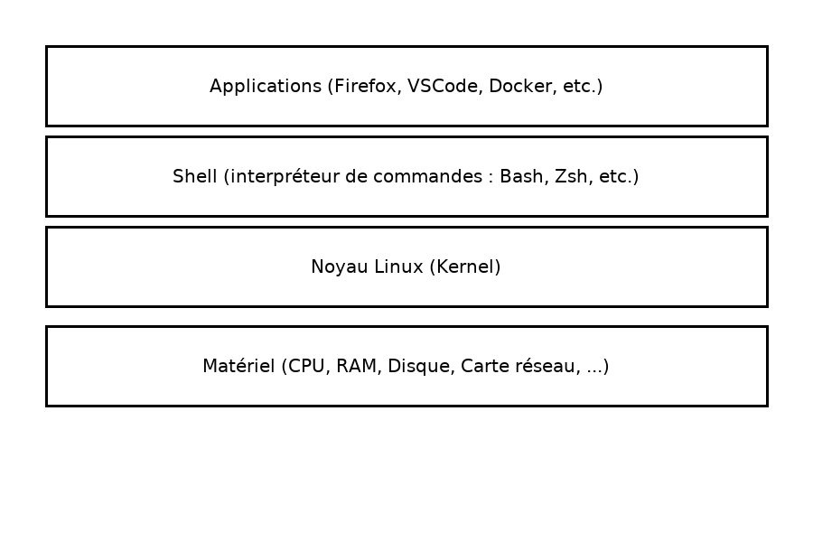

# **PARTIE 0 | Comprendre le système UNIX / Linux**

## 1) **Le modèle UNIX (le cœur du système)**

Un système Linux se compose de trois couches principales :



### Rôles :

| Élément            | Rôle                                              |
| ------------------ | ------------------------------------------------- |
| **Kernel (noyau)** | Gère les ressources : mémoire, fichiers, matériel |
| **Shell (bash)**   | Interface entre l’utilisateur et le noyau         |
| **Utilisateur**    | Lance des programmes                              |

**Ce que fait Bash** → il envoie des **commandes** au **noyau**.

---

## 2) **Dans Linux, tout est fichier (ou presque)**

- Une clé USB → fichier spécial

- Une carte réseau → fichier

- Un programme → fichier

- Une ligne dans le terminal → flux de données

→ Ce principe est ce qui rend l’automatisation **simple**.

---

## 3) **L’arborescence des fichiers UNIX**

**Important** : il y a **un seul arbre**, qui commence à **/**  
(pas de C:, D:, etc.)

```
/
├── bin/        → commandes de base (ls, cp, mv, bash…)
├── boot/       → noyau & fichiers de démarrage
├── dev/        → appareils matériels (disques, ports…)
├── etc/        → configuration du système
├── home/       → dossiers personnels des utilisateurs
│   ├── alice/
│   └── bob/
├── lib/        → bibliothèques partagées
├── media/      → points de montage automatiques (clés USB)
├── mnt/        → montages manuels
├── opt/        → logiciels additionnels
├── root/       → dossier personnel de root (administrateur)
├── sbin/       → commandes système (administration)
├── tmp/        → fichiers temporaires
├── usr/        → programmes et bibliothèques utilisateur
└── var/        → logs, bases de données, spool services
```

 **À retenir** : L'utilisateur travaille **dans son répertoire `/home/nom`**, **jamais dans `/`** au début.

---

## 4) **Utilisateur, groupe, root**

### 3 types d’acteurs dans Linux :

| Élément         | Nature                         | Exemple(s)                       | Rôle                                                    |
| --------------- | ------------------------------ | -------------------------------- | ------------------------------------------------------- |
| **Utilisateur** | Individu (compte personnel)    | `manu`, `alice`, `postgres`      | Possède des fichiers, lance des commandes               |
| **Groupe**      | Ensemble d’utilisateurs        | `sudo`, `formateurs`, `www-data` | Définit des **droits communs** à plusieurs utilisateurs |
| **root**        | Compte utilisateur **spécial** | `root`                           | Accès total au système *(à utiliser avec précaution)*   |

Pour devenir root temporairement :

```bash
sudo commande
```

---

## 5) **Les Permissions UNIX — Comprendre *Utilisateur*, *Groupe* et *Autres***

Dans Linux, **chaque fichier ou dossier appartient à :**

1. **Un utilisateur** (appelé aussi *propriétaire*)
2. **Un groupe**
3. **Et tout le reste du monde** (*autres utilisateurs*)

On parle donc de **trois catégories** :

| Catégorie       | Abréviation | Qui cela représente ?                                   |
| --------------- |:-----------:| ------------------------------------------------------- |
| **Utilisateur** | `u`         | La personne qui possède le fichier                      |
| **Groupe**      | `g`         | Les membres du même groupe que le possesseur du fichier |
| **Autres**      | `o`         | Tous les autres utilisateurs du système                 |

---

### Exemple réel

Exécutons :

```bash
ls -l secret.txt
```

Résultat possible :

```
-rw-r----- 1 manu formateurs 12 jan 22 14:20 secret.txt
```

Découpons cette ligne :

```
- rw-r----- 1   manu   formateurs    12 jan 22 14:20   secret.txt
│    │      │     │         │
│    │      │     │         └── groupe propriétaire du fichier
│    │      │     └── utilisateur propriétaire du fichier
│    │      └── nombre de liens (peu utile pour les débutants)
│    └── permissions
└── type de fichier (- = fichier normal, d = dossier)
```

---

### Qui peut faire quoi ici ?

| Catégorie             | Identité dans l'exemple | Droits | Traduction                                             |
| --------------------- | ----------------------- | ------ | ------------------------------------------------------ |
| **Utilisateur (`u`)** | `manu`                  | `rw-`  | Manu peut **lire** et **modifier** le fichier          |
| **Groupe (`g`)**      | `formateurs`            | `r--`  | Les formateurs peuvent **lire**, mais **pas modifier** |
| **Autres (`o`)**      | tout le reste           | `---`  | Personne d'autre ne peut y accéder                     |

 C’est **précis**, **proportionné**, **contrôlable**.

---

### Pourquoi un système en 3 niveaux ?

Parce qu’un système multi-utilisateurs (serveur, machine de formation, entreprise…) doit :

* Empêcher qu’un stagiaire efface les fichiers d’un autre
* Empêcher qu’une application modifie un fichier système
* Permettre à un groupe (ex : formateurs) de **collaborer** sans tout rendre public

**C’est du contrôle d’accès**, comme les clés d’un bâtiment.

---

### Modifier les permissions

On utilise `chmod`.

### Méthode symbolique

```bash
chmod u+r secret.txt     # Ajouter la lecture pour l’utilisateur
chmod g-w secret.txt     # Retirer l’écriture du groupe
chmod o-r secret.txt     # Enlever la lecture aux autres
```

### Méthode en octal (très utilisée en administration)

| Chiffre | Signification | Droits                   |
| -------:| ------------- | ------------------------ |
| 7       | rwx           | lire + écrire + exécuter |
| 6       | rw-           | lire + écrire            |
| 5       | r-x           | lire + exécuter          |
| 4       | r--           | lire seulement           |
| 0       | ---           | aucun droit              |

Exemple :

```bash
chmod 640 secret.txt
```

Correspond à :

```
u = rw-
g = r--
o = ---
```

---

### Et le super-utilisateur *root* ?

* **root peut tout faire**
* ignore toutes les permissions
* s’utilise **uniquement quand nécessaire**

Commande pour temporairement agir comme root :

```bash
sudo commande
```

---

## 6) **Distribution Linux = noyau + outils + organisation**

Debian / Ubuntu / Mint partagent tous :

- un noyau Linux

- des outils GNU (bash, coreutils…)

- un gestionnaire de paquets (`apt`)

```
Distribution = Linux (kernel) + GNU (shell + outils) + logiciels + politiques système
```

 C’est pour ça que **les commandes sont les mêmes sur Mint, Debian, Ubuntu, Kali, etc.**
