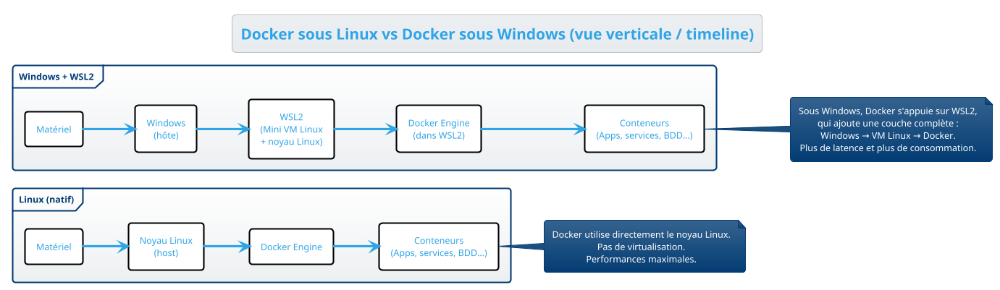
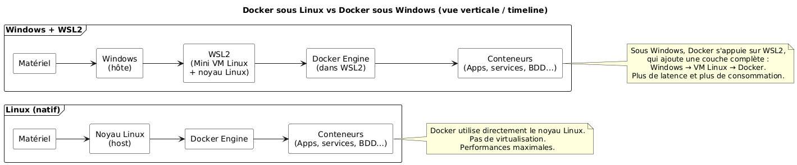
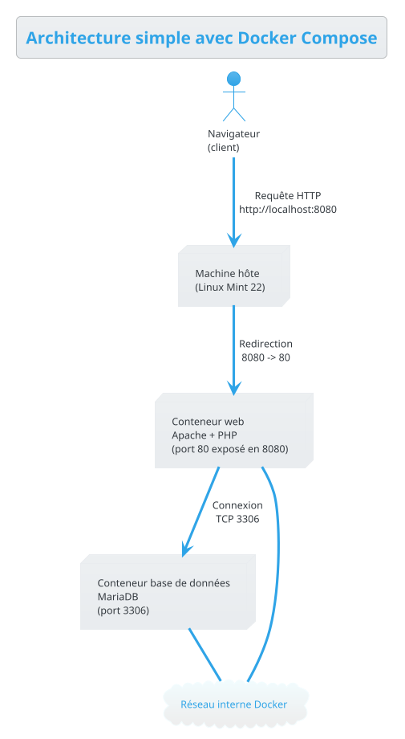
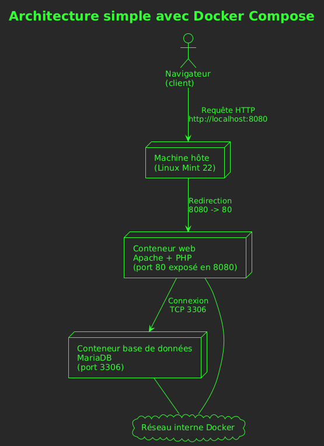

# **Docker – Support de cours**

# **0. Histoire et utilisation de Docker dans le développement**

Docker apparaît en 2013, dans un contexte où les développeurs avaient de plus en plus besoin d’environnements reproductibles, faciles à partager et capables de fonctionner sur n’importe quelle machine sans avoir à installer des dizaines de dépendances. Avant Docker, les équipes utilisaient soit des machines virtuelles lourdes, soit des installations locales instables qui variaient d’un poste à l’autre. Docker a popularisé le principe du conteneur : un espace isolé, minimaliste, capable d’exécuter une application avec toutes ses dépendances, de la même manière sur Linux, macOS, Windows et sur les serveurs de production.

Très rapidement, Docker est devenu un outil incontournable du développement moderne. Il est aujourd’hui utilisé pour lancer des environnements web complets, tester plusieurs versions d’un langage, déployer des API, héberger des bases de données, isoler des microservices ou reproduire fidèlement les conditions d’un serveur de production. Son adoption massive a transformé la manière de travailler des développeurs.

Sur Linux, Docker fonctionne de manière native. Les conteneurs utilisent directement les mécanismes du noyau Linux (cgroups, namespaces). Cela rend l’exécution légère, rapide et très peu coûteuse en ressources. Sous Windows, la situation est différente. Docker doit s’appuyer sur une couche intermédiaire appelée WSL (Windows Subsystem for Linux) ou, autrefois, sur une virtualisation Hyper-V complète. Cette couche supplémentaire consomme plus de ressources, entraîne une légère perte de performance et complexifie parfois l’accès aux fichiers. C’est pour cette raison que travailler avec Docker sous Linux reste systématiquement plus fluide, plus fiable et plus naturel que sous Windows.





Comprendre Docker en ligne de commande est essentiel avant d’utiliser un outil graphique. La ligne de commande montre exactement ce qui se passe : quelles images sont téléchargées, comment les conteneurs démarrent, quels ports sont exposés, et comment persistent les volumes. Les interfaces graphiques masquent souvent ces détails et donnent l’illusion que Docker est un simple clic–bouton, alors qu’il repose sur une logique précise qu’il faut comprendre pour être autonome. La ligne de commande permet également de diagnostiquer les problèmes, d’interpréter les logs et de comprendre les erreurs. C’est cette compréhension qui permet ensuite d’utiliser un outil graphique sans être totalement dépendant de lui.

---

## **1. Installation de Docker**

Avant d’utiliser Docker, on va s’assurer que l’environnement est propre. On commence par supprimer d’anciennes installations éventuelles, puis on prépare la machine à recevoir la version officielle de Docker.

```bash
for pkg in docker.io docker-doc docker-compose docker-compose-v2 podman-docker containerd runc; do
  sudo apt-get remove -y "$pkg" 2>/dev/null || true
done
```

On installe ensuite les certificats nécessaires, puis la clé officielle de Docker, placée dans le répertoire recommandé par les nouvelles bonnes pratiques.

```bash
sudo apt-get update
sudo apt-get install ca-certificates curl -y
sudo install -m 0755 -d /etc/apt/keyrings
sudo curl -fsSL https://download.docker.com/linux/ubuntu/gpg -o /etc/apt/keyrings/docker.asc
sudo chmod a+r /etc/apt/keyrings/docker.asc
```

Le dépôt officiel est ajouté, puis on met à jour la liste des paquets.

```bash
echo \
"deb [arch=$(dpkg --print-architecture) signed-by=/etc/apt/keyrings/docker.asc] https://download.docker.com/linux/ubuntu \
$(. /etc/os-release && echo "$UBUNTU_CODENAME") stable" | \
sudo tee /etc/apt/sources.list.d/docker.list > /dev/null

sudo apt-get update
```

Docker CE peut alors être installé :

```bash
sudo apt-get install docker-ce docker-ce-cli containerd.io docker-buildx-plugin docker-compose-plugin -y
```

Un premier test sert à valider l’installation :

```bash
sudo docker run hello-world
```

---

## **2. Introduction générale**

Docker est un outil permettant d’exécuter des applications dans des environnements isolés appelés conteneurs. Un conteneur est une application préconfigurée, souvent prête à l’emploi. Docker se charge de la gestion des images, de l’exécution et de l’isolation.

Docker est utilisé pour lancer une base de données, un site web, un serveur de messagerie ou encore un environnement complet de développement PHP ou Symfony. Lorsqu’on utilise Docker, on cherche avant tout la simplicité : démarrer une application sans avoir à la configurer longuement sur sa machine.

---

## **3. Utiliser des conteneurs avec Docker Compose**

Docker Compose permet de démarrer plusieurs conteneurs coordonnés, en utilisant un simple fichier de configuration. C’est ce fichier, généralement nommé `docker-compose.yml`, qui décrit les services nécessaires au projet.

Les documents fournis (compose.pdf) expliquent le fonctionnement général : les ports, les volumes, la syntaxe d’un fichier compose et plusieurs exemples réels (MariaDB seul, MariaDB + Adminer, phpMyAdmin, Mailhog).

Il faut comprendre que la syntaxe `- local:container` signifie que le port de la machine hôte est relié au port interne du conteneur. Cela permet d’accéder à MariaDB, à une interface d’administration ou à un serveur web directement dans le navigateur.

Les volumes permettent d’éviter que les données disparaissent lorsque le conteneur s’arrête. Ils sont essentiels pour la persistance des bases de données et pour le code source des projets PHP.

L’important à retenir est le cycle complet :  
`docker compose up -d` pour démarrer,  
`docker compose down` pour arrêter,  
`docker compose ps` pour voir les services en cours,  
`docker compose exec <service> bash` pour entrer dans un conteneur.

---

## **4. Comprendre la logique d’une architecture Docker**

Lorsque plusieurs conteneurs fonctionnent ensemble, l’architecture devient très simple à visualiser. Voici une représentation textuelle permettant à chacun de comprendre la circulation des requêtes :



#### 

Cette structure montre que les conteneurs communiquent entre eux grâce au réseau interne créé automatiquement par Docker Compose. L’utilisateur n’a besoin d’exposer que les services dont il a réellement besoin (par exemple, l’interface web). La base de données, elle, reste invisible depuis l’extérieur, ce qui améliore la sécurité.

---

## **5. Créer ses propres conteneurs avec Dockerfile**

Le second document fourni (compose_dockerfile.pdf) explique comment construire un conteneur à partir d’un fichier nommé Dockerfile. Ce fichier décrit la manière dont le conteneur doit être préparé : système de base, paquets à installer, réglages éventuels, copie de fichiers, configuration de PHP ou installation de Composer.

Un Dockerfile commence toujours par une image de base :

```bash
FROM debian:12
```

Puis il enchaîne sur une série de commandes exécutées dans le conteneur.  
Par exemple :

```bash
RUN apt-get update
RUN apt-get install git -y
```

Un fichier compose peut ensuite utiliser ce Dockerfile grâce à la directive `build: .`, ce qui permet de lancer un projet complet basé sur un environnement sur mesure.

C’est cette approche qui permet, dans l’exemple fourni, d’obtenir un environnement complet PHP 8.4 + Composer + Symfony + Xdebug.

---

## **6. Erreurs courantes et solutions**

Certains messages d’erreur reviennent souvent, surtout lors des premiers tests.

### Port déjà utilisé

```bash
Bind for 0.0.0.0:3306 failed: port already allocated
```

Cela signifie qu’une autre application utilise déjà ce port.  
Modifier la partie gauche dans le compose suffit :

```bash
3308:3306
```

### Impossible de se connecter à MariaDB

```bash
ERROR 2002 (HY000): Can't connect to MySQL server
```

Dans ce cas, il faut s’assurer que le conteneur de la base de données est bien démarré et que le service auquel on se connecte porte le bon nom, par exemple `db` dans la configuration.

### Conteneur qui se relance en boucle

Avec `restart: always`, un conteneur mal configuré peut continuellement redémarrer.  
Une première étape consiste à inspecter les logs :

```bash
docker compose logs <service>
```

---

## **7. Manipuler les conteneurs dans la pratique**

Pour mieux comprendre ce qui se passe, il est important d’entrer dans un conteneur et de voir l’environnement réel. Cette pratique rend Docker concret et rassurant.

```bash
docker compose exec web bash
```

Depuis là, on peut afficher la version de PHP, parcourir les fichiers du site, vérifier les modules Apache. On peut également entrer dans le conteneur de la base de données pour voir les fichiers stockés dans `/var/lib/mysql`.

Cette exploration donne confiance aux stagiaires, qui réalisent alors qu’un conteneur n’est rien d’autre qu’un petit système Debian isolé et facile à supprimer.

Une information simple mais essentielle concerne la manière de remettre un projet Docker à zéro. Lorsque l’on souhaite redémarrer entièrement une stack, y compris avec une base de données vide ou un projet complètement propre, il est possible de supprimer non seulement les conteneurs, mais aussi les volumes. Cette suppression complète se fait ainsi :

```bash
docker compose down -v
```

Cette commande arrête tous les conteneurs du projet, les supprime, puis supprime également les volumes attachés. Elle est utile lorsqu’une base de données doit être réinitialisée, lorsqu’un conteneur a été mal configuré ou lorsque l’on souhaite repartir d’un environnement vierge sans laisser traîner de fichiers persistants.

---

## **8. TP : Construire une stack complète**

Le but du TP est de créer une mini architecture composée de trois services : un conteneur Apache/PHP pour le site web, un conteneur MariaDB pour la base de données, et un conteneur Adminer pour administrer cette base.

L’objectif est de permettre la visualisation des flux, la manipulation des conteneurs et la compréhension de la logique Docker sans être noyés par la complexité.

Le dossier doit contenir un fichier `docker-compose.yml` ainsi qu’un répertoire `www` qui accueillera un fichier `index.php`. Une fois les services démarrés, Apache sera accessible sur le port 8080, et Adminer sur le port 8081.

Ce TP permet de mettre en pratique les volumes, les ports, les réseaux et les bonnes pratiques de base de Docker Compose.

---

## **9. Pourquoi utiliser Docker ?**

Il est important de comprendre que Docker est un outil conçu pour faciliter la vie du développeur. Grâce à lui, il devient possible d’avoir un environnement de travail reproductible, cohérent et facile à partager.

Docker évite de manipuler directement les services sur sa machine, limite les conflits de versions, protège l’intégrité du système et permet de tester plusieurs versions de PHP, de MySQL ou de Symfony sans jamais casser sa configuration principale.

Docker prépare aussi progressivement aux outils utilisés en entreprise, où les environnements de production sont généralement orchestrés via Compose, Swarm ou Kubernetes.`
