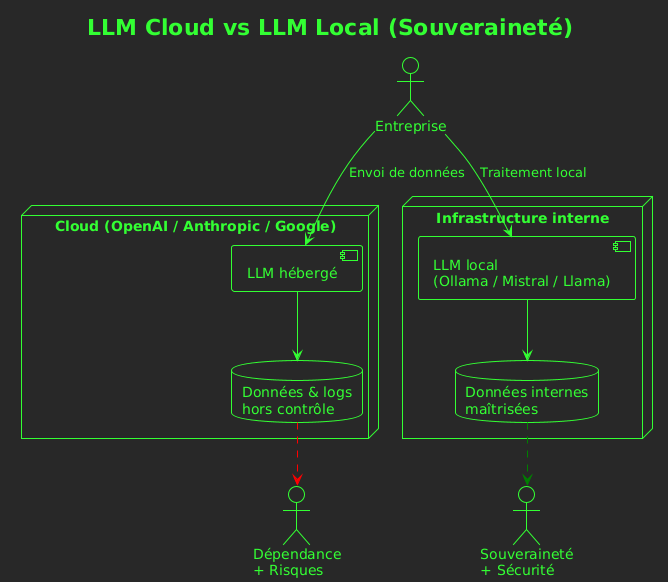

# **LLM en entreprise : enjeux, responsabilités et installation locale avec Ollama**

---

## **1. Introduction : pourquoi parle-t-on autant des LLM aujourd’hui ?**

Depuis 2023, l’arrivée des grands modèles de langage (LLM) a bouleversé la manière de travailler. Qu’il s’agisse de rédiger, analyser, programmer ou automatiser, ces outils sont capables de comprendre une consigne en langage naturel et de produire un résultat crédible et souvent pertinent.
Mais cette puissance s’accompagne de questions essentielles : **peut-on faire confiance à ces modèles ? Où vont les données que nous leur envoyons ? Pourquoi certaines entreprises refusent l’usage d’outils en ligne ? Et comment mettre en place une alternative locale, souveraine et contrôlée ?**

Ce cours vise à répondre à ces questions tout en préparant l’installation d’un LLM local via **Ollama**, que vous utiliserez dans votre fil rouge CDA.

---

## **2. Comment fonctionne réellement un LLM ?**

Un LLM n’est pas un “cerveau” ni une intelligence humaine.
C’est un modèle statistique entraîné sur d’immenses volumes de texte. Il “prévoit” les mots les plus probables pour continuer une phrase. Ce fonctionnement mécanique produit parfois une illusion d’intelligence, car le modèle peut manipuler des concepts, du code ou des raisonnements.

Ce résultat est le fruit de plusieurs décennies de recherches : après les anciens systèmes experts basés sur des règles écrites à la main, l’IA moderne s’appuie sur des [réseaux de neurones](https://fr.wikipedia.org/wiki/R%C3%A9seau_de_neurones_artificiels), puis sur l’architecture [Transformer](https://fr.wikipedia.org/wiki/Transformeur), apparue en 2017, qui permet d’analyser de grandes quantités de texte en parallèle. Grâce au big data, aux GPU et à de nouvelles techniques d’entraînement, ces modèles apprennent des milliers de structures linguistiques sans comprendre leur sens.

Ainsi, même si un LLM peut sembler “raisonner”, il ne possède ni intention, ni conscience, ni perception du réel : il ne fait que reproduire statistiquement des formes présentes dans ses données. C’est cette absence de compréhension qui explique une grande partie des risques que nous allons voir.

---

## **3. Les grands enjeux de l’IA en entreprise**

### **3.1. Souveraineté numérique : qui contrôle l’information ?**

Quand une entreprise utilise un LLM hébergé par un géant du cloud (OpenAI, Anthropic, Google…), elle dépend :

- d’un fournisseur étranger,

- d’un stockage de données hors de son contrôle,

- d’une infrastructure dont elle ne maîtrise pas les mises à jour, les logs ou la sécurité réelle.

De nombreuses organisations (administrations, industries, banques) préfèrent une approche **souveraine**, où les données restent **sur leurs propres serveurs**.

Installer un LLM local via Ollama, ou un modèle open-source comme Mistral, Llama ou Qwen, permet :

- de garder les données *en interne*,

- de garantir qu’aucune information stratégique ne quitte le réseau,

- d’être indépendant d’un acteur américain ou chinois.

Sans souveraineté, pas de cybersécurité.



---

### **3.2. Sécurité et confidentialité : un impératif absolu**

Quand vous envoyez un message à un service externe, même si la politique annonce “pas d’entraînement avec vos données”, il y a toujours :

- des logs techniques,

- des métadonnées,

- des stockages temporaires,

- des sauvegardes,

- des traces dans des systèmes que vous ne contrôlez pas.

Pour des données sensibles (documents RH, informations médicales, secrets industriels, dossiers clients, code source propriétaire) **c’est rédhibitoire**.

Le NIST (organisme américain de standardisation) rappelle que l’usage d’un LLM doit être encadré par :

- une politique de confidentialité stricte,

- une classification des données,

- et une vérification permanente.

L’approche la plus sûre reste :
 "Ne jamais envoyer une donnée sensible à un modèle externe."

Installer un LLM local permet justement d’éviter cela.

---

### **3.3. Les hallucinations**

Les hallucinations constituent l’une des limites majeures des LLMs. Concrètement, un modèle peut très bien inventer une loi qui n’existe pas, créer une fonction ou une commande imaginaire, affirmer un fait totalement faux mais avec une grande assurance, attribuer une citation à la mauvaise personne, ou encore générer du code qui semble correct… mais dans un autre langage ou dans un contexte inadapté.

À mesure que les modèles progressent, ces erreurs deviennent plus subtiles : elles se camouflent derrière une forme de cohérence apparente qui les rend parfois difficiles à repérer, même pour un utilisateur expérimenté.

La cause est simple : un LLM n’a aucune conscience du réel. Il ne vérifie rien, il ne sait rien ; il produit ce qui lui paraît *statistiquement plausible* à partir de ses données d’entraînement. Autrement dit, ce qui semble vrai n’est pas nécessairement vrai.

Dans un contexte professionnel, cela implique plusieurs règles de prudence : ne jamais faire confiance aveuglément à la réponse d’un modèle, toujours valider humainement les informations avant utilisation, vérifier les sources lorsque c’est possible, et s’assurer que les utilisateurs restent pleinement responsables de ce qu’ils produisent.

Ces principes relèvent de ce qu’on appelle le **HITL (Human in the Loop)** : même avec un LLM performant, l’humain doit conserver la décision finale.

---

### **3.4. Les biais : le modèle absorbe les défauts du monde**

Un LLM apprend sur des données humaines, donc il absorbe des biais culturels, des stéréotypes, des inégalités et des perspectives géopolitiques dominantes. Ce n’est pas théorique : plusieurs modèles ont déjà posé problème lors de leur mise à disposition du public.

On peut citer par exemple [Galactica](https://www.technologyreview.com/2022/11/18/1063487/meta-large-language-model-ai-only-survived-three-days-gpt-3-science/), un modèle de Meta présenté comme un assistant scientifique, qui a été retiré en quelques jours car il produisait des contenus pseudo-scientifiques et trompeurs avec un ton très assuré (inventions de références, confusion entre faits et spéculations).
Plus récemment, certains systèmes de génération d’images et de texte (par exemple la première version publique de [Gemini](https://fr.wikipedia.org/wiki/Gemini_(IA)) de Google pour la génération d’images) ont été critiqués pour leurs réponses historiquement inexactes ou excessivement orientées dans leur représentation des personnes et des événements, ce qui a obligé l’éditeur à suspendre puis corriger certaines fonctionnalités.

Ces exemples illustrent comment des biais présents dans les données ou dans les réglages du modèle peuvent se traduire par des réponses orientées, simplificatrices ou parfois discriminantes.
C’est pourquoi un bon usage des LLM impose de garder une analyse critique, de prendre du recul sur les réponses produites et de procéder à des vérifications systématiques, surtout lorsqu’il s’agit de sujets sensibles ou d’informations diffusées à un public.

---

## **4. Risques géopolitiques : dépendance, censure, influence**

L’IA est devenue un outil stratégique à l’échelle mondiale. La plupart des grands modèles actuels sont développés par des entreprises américaines comme OpenAI, Google ou Meta, ou par des acteurs chinois tels qu’Alibaba et Baidu. L’Europe, malgré un excellent niveau de recherche académique, n’a pas investi au même rythme. Résultat : elle se retrouve aujourd’hui largement dépendante des innovations produites hors de son territoire.
Même des réussites récentes comme Mistral montrent que des talents européens existent, mais ces projets s’appuient souvent sur des capitaux américains ou internationaux, ce qui pose la question du contrôle réel et de l’autonomie stratégique.

La question n’est donc plus seulement technique ; elle est profondément politique et géopolitique.
Qui contrôle les modèles ? Quelles données ont servi à leur entraînement ? Quelle vision du monde est intégrée dans leurs réponses ? Quels gouvernements peuvent imposer des restrictions d’accès, des filtres ou des obligations légales ? Que se passe-t-il si un fournisseur étranger modifie ses conditions, restreint l’accès ou coupe un service critique ?

Dans ce contexte global, installer un modèle open-source local n’est pas un simple choix technique : c’est un geste d’autonomie et de résilience. Cela signifie limiter la dépendance vis-à-vis des acteurs extra-européens, s’affranchir des tensions internationales, et garder la maîtrise totale de la chaîne technologique, depuis l’infrastructure jusqu’aux données internes.

Le local devient ainsi une manière de rééquilibrer une situation où l’Europe n’a pas su investir suffisamment tôt, afin de retrouver un minimum de souveraineté dans un domaine devenu central pour l’économie, la défense, l’innovation et la formation.

---

## **5. Enjeux écologiques : l’impact non négligeable de l’IA**

Entraîner un modèle comme GPT-4 consomme autant d’eau qu’une petite ville pendant plusieurs jours, et demande une énergie colossale.
De plus, utiliser en permanence des modèles hébergés via API augmente les émissions carbone du cloud mondial.

Au contraire, un modèle **local**, **quantifié** (4 bits, 8 bits), **optimisé**, tournant sur une machine raisonnable :

- réduit les besoins énergétiques,

- évite les allers-retours réseau massifs,

- diminue la dépendance au cloud,

- prolonge la vie des machines existantes (le local peut tourner sur du matériel récent mais non datacenter).

L’écologie n’est donc pas un détail mais un argument supplémentaire pour le local.

---

# **6. Pourquoi installer un LLM local avec Ollama ?**

Ollama est une plateforme simple permettant :

- d’héberger un modèle open-source sur son ordinateur,

- de l’utiliser via une API locale,

- sans connexion Internet,

- avec confidentialité totale,

- avec une installation très rapide.

Ollama est compatible avec des modèles modernes comme :

- Mistral

- Llama 3 / Llama 2

- Qwen

- Phi

- Gemma

- DeepSeek-R1

- Mixtral

C’est l’outil idéal pour comprendre *vraiment* comment tourne un modèle en local et pour produire un prototype d’application souveraine.

Ce sera une compétence clé de votre fil rouge CDA.

---

# **7. Installation d’un LLM en local avec Ollama (introduction pédagogique)**

## **Installation d’Ollama**

Sur Linux :

```bash
curl -fsSL https://ollama.com/install.sh | sh
```

Sur Windows / macOS :
télécharger l’exécutable via [https://ollama.com](https://ollama.com)

Une fois ollama installé l'aide est disponible dans un terminal : `ollama --help`

```bash
manwax@eldorado:~$ ollama --help
Large language model runner

Usage:
  ollama [flags]
  ollama [command]

Available Commands:
  serve       Start ollama
  create      Create a model
  show        Show information for a model
  run         Run a model
  stop        Stop a running model
  pull        Pull a model from a registry
  push        Push a model to a registry
  signin      Sign in to ollama.com
  signout     Sign out from ollama.com
  list        List models
  ps          List running models
  cp          Copy a model
  rm          Remove a model
  help        Help about any command

Flags:
  -h, --help      help for ollama
  -v, --version   Show version information

Use "ollama [command] --help" for more information about a command.
```

---

## **Démonstration : installer, lancer et interroger un modèle local avec Ollama**

Nous allons maintenant voir ensemble comment fonctionne concrètement un modèle de langage exécuté **entièrement en local**.
Pas de cloud, pas d’envoi de données vers l’extérieur.

---

## **Étape 1 – Télécharger un modèle**

Le site web ollama.com permet de lister les [modèles disponibles](https://ollama.com/search).

Dans la démonstration, nous allons utiliser le modèle gemma3, un modèle open-source et léger.

La commande suivante télécharge le modèle :

```bash
ollama pull gemma3:4b
```

Ollama récupère les fichiers nécessaires, et dès la fin du téléchargement, le modèle est prêt à être utilisé.
Aucune configuration supplémentaire n’est requise.

---

### **Étape 2 – Lancer le modèle**

Une fois téléchargé, on peut lister les modèles présent localement :

```bash
ollama list
```

Il suffit de d’exécuter :

```bash
ollama run gemma3:4b
```

Un prompt apparaît : c’est une interface locale prêt à répondre.
Vous pouvez poser une question, demander une explication, générer du texte ou du code.

Et le point essentiel :
**tout ce que vous envoyez reste sur votre machine. Aucun transfert réseau n’est effectué.**

C’est la particularité d’un modèle local : les données ne sortent jamais de l’environnement.

---

### **Étape 3 – Appeler le modèle via l’API locale**

Ollama active automatiquement une API accessible sur l’adresse :

```
http://localhost:11434
```

Cela signifie que n’importe quel programme (PHP, Python, JavaScript, Symfony, React, etc.) peut interroger le modèle comme un service local.

Voici une démonstration rapide en ligne de commande :

```bash
curl http://localhost:11434/api/generate \
  -d '{ "model": "gemma3", "prompt": "Explique simplement ce qu'est le RAG." }'
```

Le modèle répond immédiatement, en local, et vous pouvez intégrer cette réponse dans :

* un site web,
* un script interne,
* un outil métier,
* une application Symfony ou PHP,
* un agent d’automatisation,
* ou même un chatbot complet.

L’API est simple, rapide et entièrement autonome.
Vous venez d’exécuter votre premier service d’IA souverain.

---

### **Puis ... Ajouter vos propres fichiers (RAG local)**

Ollama peut fonctionner avec des outils comme :

- **LlamaIndex**

- **LangChain**

- **ChromaDB**

- **Milvus**

pour lire des PDF, des docs métier, des fichiers internes, et permettre au modèle de répondre sur **votre** connaissance interne sans fuite de données.

---

# **8. Conclusion générale du cours**

Installer un LLM local est un acte technologique mais aussi stratégique.
Il permet :

- une maîtrise totale des données,

- une souveraineté numérique réelle,

- une réduction des risques,

- une meilleure conformité,

- et un impact écologique plus raisonnable.

Mais l’usage d’un LLM reste soumis à :

- la vigilance humaine,

- la vérification systématique,

- une compréhension des risques,

- et une éthique professionnelle.
