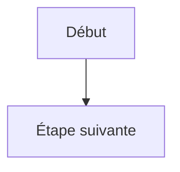
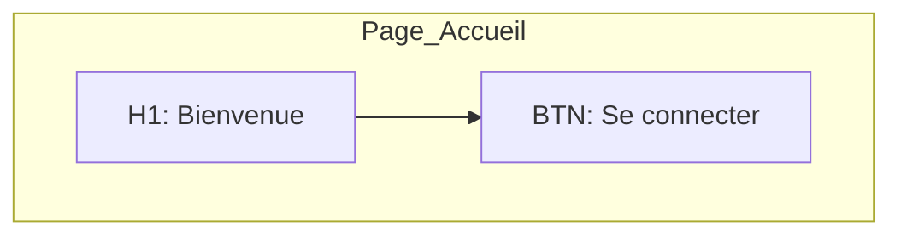
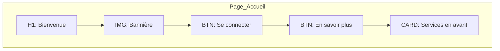
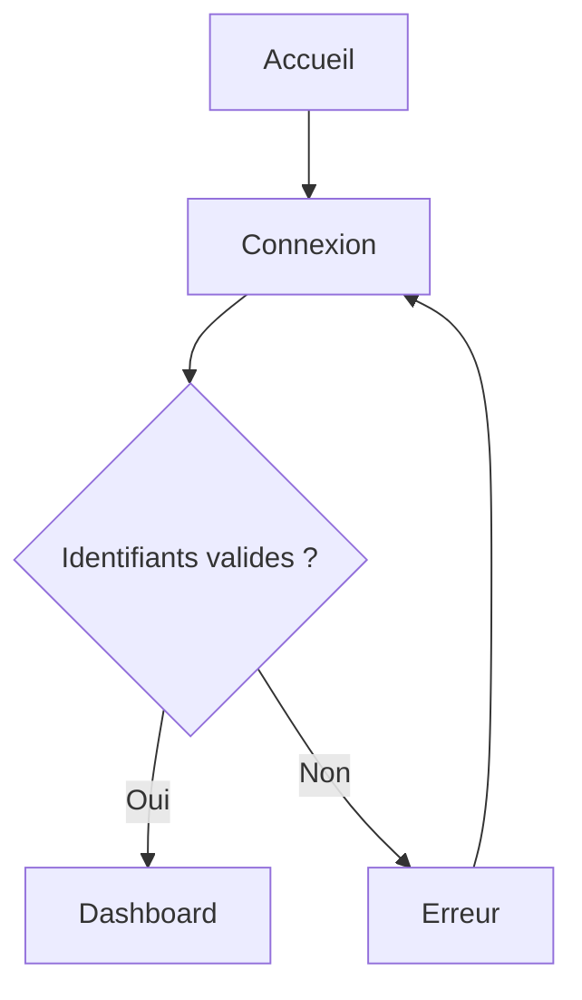
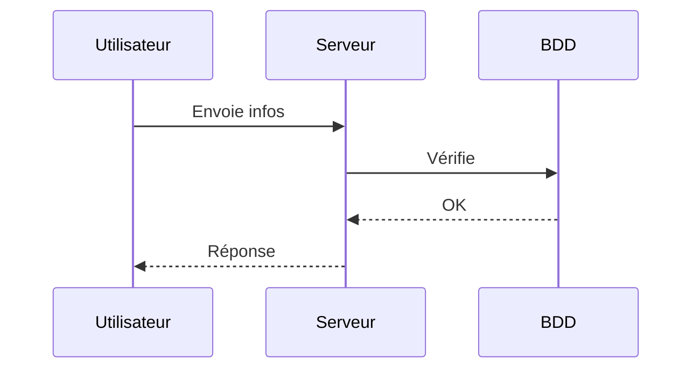
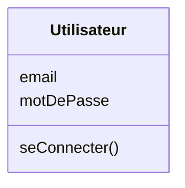

#  **Documentation – Tutoriel d’introduction à MermaidJS**

*Créer des diagrammes textuels, lisibles et professionnels*

---

##  1. Qu’est-ce que MermaidJS ?

MermaidJS est un langage **entièrement textuel** qui permet de créer des diagrammes automatiquement.
On écrit *du code*, et Mermaid génère *un schéma visuel*.

Il est idéal pour :

* représenter un parcours utilisateur
* concevoir des pages en wireframe
* expliquer un workflow
* modéliser un algorithme
* documenter un projet
* travailler en équipe (Git/GitHub)

Et surtout : **il est parfaitement accessible aux lecteurs d’écran**, car tout se fait en texte.

---

##  2. Où utiliser Mermaid ?

Vous pouvez utiliser Mermaid :

* sur le site officiel → **[https://mermaid.live](https://mermaid.live)**
* dans VS Code (avec extensions Mermaid)
* dans GitHub (les fichiers `.md` l’affichent)
* dans des pages web ou de la documentation technique

Pour débuter, **mermaid.live** est le plus simple.

---

##  3. Structure de base d’un diagramme

Un diagramme Mermaid se compose de :

```
<type-de-diagramme>
    instructions...
```

Exemple :



* `flowchart` = type de diagramme
* `TD` = Top → Down (de haut en bas)
* `A` et `B` = identifiants des blocs
* `[...]` = texte à afficher
* `-->` = flèche

---

##  4. Les directions principales

Dans un flowchart vous pouvez choisir la direction :

| Code | Direction                         |
| ---- | --------------------------------- |
| `TD` | Top → Down (haut vers bas)        |
| `BT` | Bottom → Top (bas vers haut)      |
| `LR` | Left → Right (gauche vers droite) |
| `RL` | Right → Left (droite vers gauche) |

Exemple :


---

##  5. Les blocs (nodes)

Les blocs sont créés avec des crochets `[...]`.

Exemples :

```mermaid
A[Texte simple]
B((Cercle))
C{{Losange (décision)}}
```

Les plus courants :

* `[texte]` → rectangle
* `((texte))` → cercle
* `{texte}` ou `{{texte}}` → décision / condition

---

##  6. Les flèches

###  Flèche simple

```
A --> B
```

###  Flèche avec condition

```
A -->|Oui| B
A -->|Non| C
```

###  Lien non prioritaire / décoration

```
A -.-> B
```

###  Double sens

```
A <--> B
```

---

##  7. Regrouper des éléments : les *subgraphs*

Ils servent à créer des boîtes ou sections (utile pour une maquette).

Exemple :



---

##  8. Créer un wireframe (maquette) simple

Mermaid ne gère pas les composants UI visuels, donc **on adopte une convention textuelle**.

Exemple de convention :

* `[H1: Titre]`
* `[IMG: Image]`
* `[TXT: Texte]`
* `[BTN: Bouton]`
* `[FIELD: Champ]`
* `[CARD: Bloc]`

Wireframe d’une page d'accueil :



---

##  9. Diagrammes utiles en développement

###  Parcours utilisateur (flowchart)



###  Diagramme de séquence



###  Diagramme de classes (UML simplifié)



---

##  10. Modèle universel pour tout diagramme (inclusif pour Rudy)

À utiliser dans tous les TPs :

```
## 1. Diagramme Mermaid
(code)

## 2. Liste des éléments
- A : ...
- B : ...
- C : ...

## 3. Transitions / liens
- A → B
- B → C
- C → D si condition

## 4. Résumé
(paragraphe court : ce que représente le diagramme)
```


---

##  11. Ressources utiles

* Éditeur officiel : [https://mermaid.live](https://mermaid.live)
* Documentation officielle : [https://mermaid.js.org/intro](https://mermaid.js.org/intro)
* Extensions VS Code : “Mermaid Markdown Syntax Highlighting”
* Cheat sheet (résumé) : [https://mermaid.js.org/cheat-sheet](https://mermaid.js.org/cheat-sheet)

