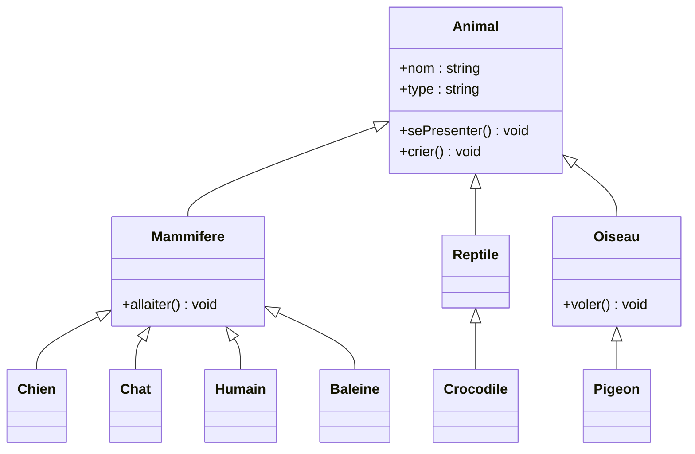
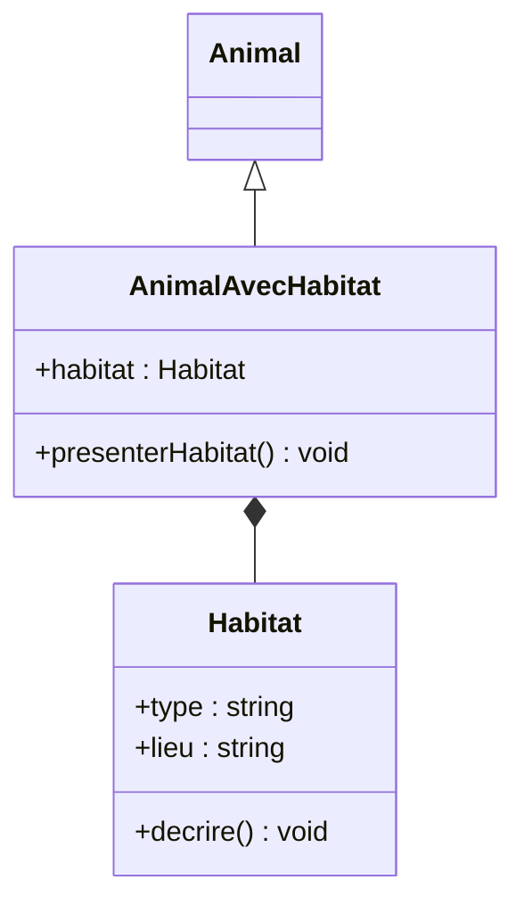
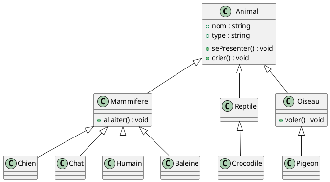

# La Programation Orientée Objet en JS

## Plan

1. Objets simples
2. Classes et constructeur
3. Encapsulation
4. Héritage (Animal, Mammifère, Reptile, Oiseau, etc.)
5. Polymorphisme
6. Composition
7. Diagrammes UML (Mermaid et PlantUML)

---

## 1. Objets simples

On part d’objets littéraux qui représentent des êtres.

```js
const inconnu = {
  type: "Inconnu",
  nom: "Inconnu",
  sePresenter() {
    console.log("Je suis un être non identifié...");
  }
};

const manu = {
  type: "Humain",
  nom: "Manu",
  espece: "Homo sapiens",
  sePresenter() {
    console.log(`Je m'appelle ${this.nom}, je suis un ${this.type}.`);
  }
};

const clara = {
  type: "Humain",
  nom: "Clara",
  espece: "Homo sapiens",
  sePresenter() {
    console.log(`Je m'appelle ${this.nom}, je suis une ${this.type}.`);
  }
};

manu.sePresenter();
clara.sePresenter();
```

Limite: il faut tout recopier à la main, pas de modèle commun.

---

## 2. Classes et constructeur

On introduit une classe de base `Etre` ou `Animal`.
Ici je prends `Animal` comme base générique, qui peut aussi représenter des humains.

```js
class Animal {
  constructor(nom = "Inconnu", type = "Inconnu") {
    this.nom = nom;
    this.type = type; // ex: "Animal", "Mammifere", "Reptile", "Humain"...
  }

  sePresenter() {
    console.log(`Je suis ${this.nom}, de type ${this.type}.`);
  }
}

const etreInconnu = new Animal();
const animalGenerique = new Animal("Créature", "Animal");
const plouf = new Animal("Plouf", "Chat");

etreInconnu.sePresenter();
animalGenerique.sePresenter();
plouf.sePresenter();
```

---

## 3. Encapsulation (attribut privé)

On veut par exemple garder l’état de santé privé.

```js
class Animal {
  #etatSante = "bon"; // privé

  constructor(nom = "Inconnu", type = "Inconnu") {
    this.nom = nom;
    this.type = type;
  }

  sePresenter() {
    console.log(`Je suis ${this.nom}, de type ${this.type}.`);
  }

  soigner() {
    this.#etatSante = "bon";
  }

  blesser() {
    this.#etatSante = "blessé";
  }

  get etatSante() {
    return this.#etatSante;
  }
}

const chatDeRue = new Animal("Grisou", "Chat");
chatDeRue.blesser();
console.log(chatDeRue.etatSante()); // "blessé"
chatDeRue.soigner();
console.log(chatDeRue.etatSante()); // "bon"
```

---

## 4. Héritage - hiérarchie animaux

On définit des niveaux: Animal -> Mammifere, Reptile, Oiseau -> Chien, Chat, Humain, Baleine, Crocodile, Pigeon.

```js
class Animal {
  constructor(nom = "truc", type = "Animal") {
    this.nom = nom;
    this.type = type;
  }

  sePresenter() {
    console.log(`Je suis ${this.nom}, je suis un ${this.type}.`);
  }

  crier() {
    console.log(`${this.nom} pousse un potzllllz...`);
  }
}

// Niveau intermédiaire
class Mammifere extends Animal {
  constructor(nom = "machin") {
    super(nom, "Mammifere");
  }

  allaiter() {
    console.log(`${this.nom} allaite ses petits.`);
  }
}


class Reptile extends Animal {
  constructor(nom = "Inconnu") {
    super(nom, "Reptile");
  }
}

class Oiseau extends Animal {
  constructor(nom = "Inconnu") {
    super(nom, "Oiseau");
  }

  voler() {
    console.log(`${this.nom} essaie de voler...`);
  }
}

// Spécialisations
class Chien extends Mammifere {
  crier() {
    console.log(`${this.nom} aboie: "Wouf"`);
  }
}

class Chat extends Mammifere {
  crier() {
    console.log(`${this.nom} miaule: "Miaou"`);
  }
}

class Humain extends Mammifere {
  constructor(nomPropre = "Inconnu") {
    super(nomPropre);
    this.type = "Humain";
  }

  crier() {
    console.log(`${this.nom} parle: "Bonjour, je suis un humain."`);
  }
}

class Baleine extends Mammifere {
  crier() {
    console.log(`${this.nom} chante un chant de baleine...`);
  }
}

class Crocodile extends Reptile {
  crier() {
    console.log(`${this.nom} grogne d'un air menaçant.`);
  }
}

class Pigeon extends Oiseau {
  crier() {
    console.log(`${this.nom} roucoule: "Rou rou"`);
  }
}
```

Et on crée nos amis Manu et Clara:

```js
const manu = new Humain("Manu");
const clara = new Humain("Clara");
const medor = new Chien("Medor");
const minou = new Chat("Minou");
const willy = new Baleine("Willy");
const croco = new Crocodile("Croco");
const piou = new Pigeon("Piou");
```

---

## 5. Polymorphisme

Même méthode `crier()`, comportement différent selon la classe.

```js
const etres = [manu, clara, medor, minou, willy, croco, piou];

etres.forEach((etre) => {
  etre.sePresenter();
  etre.crier();
});
```

C’est ça le polymorphisme: **une même interface (même nom de méthode), plusieurs comportements**.

---

## 6. Composition

Par exemple, un `Habitat` qui n’est pas un animal, mais un objet utilisé par un animal.

```js
class Habitat {
  constructor(type, lieu) {
    this.type = type; // "Maison", "Forêt", "Ville", "Océan", "Marais"...
    this.lieu = lieu;
  }

  decrire() {
    console.log(`Habitat: ${this.type} situé à ${this.lieu}.`);
  }
}

class AnimalAvecHabitat extends Animal {
  constructor(nom, type, habitat) {
    super(nom, type);
    this.habitat = habitat;
  }

  presenterHabitat() {
    this.sePresenter();
    this.habitat.decrire();
  }
}

const habitatManu = new Habitat("Maison", "Amiens");
const manuAvecHabitat = new AnimalAvecHabitat("Manu", "Humain", habitatManu);

manuAvecHabitat.presenterHabitat();
```

---

## 7. Diagrammes UML

### 7.1 Mermaid - hiérarchie Animal



### 7.2 Mermaid - composition avec Habitat



### 7.3 PlantUML - même hiérarchie


