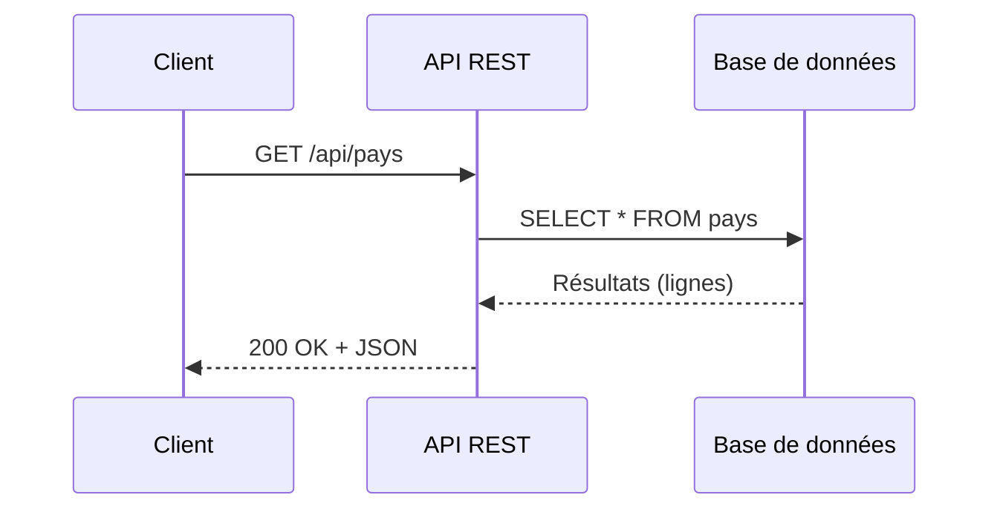
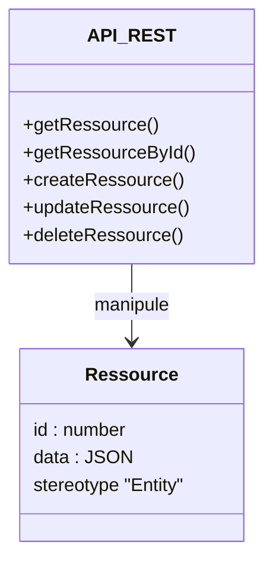
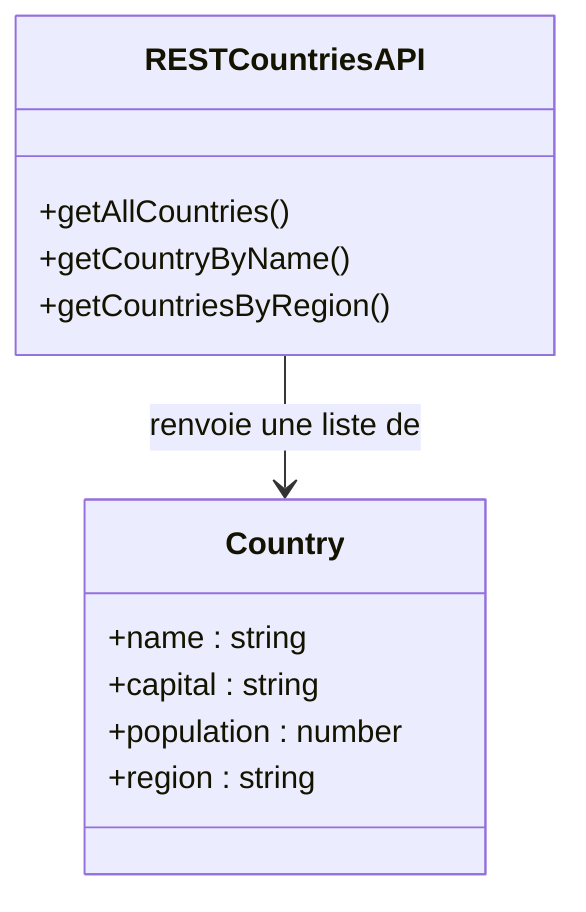
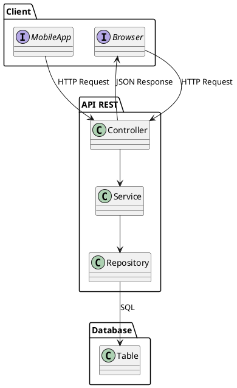

# **Définition technique complète d’une API REST (niveau CDA)**

Une **API REST** est une interface de communication entre systèmes fondée sur les principes de l’architecture **REST (Representational State Transfer)**.
Elle permet à un client (navigateur, application mobile, script, backend…) de **manipuler des ressources** situées sur un serveur via des **requêtes HTTP standardisées**.

## 1. Ressource

Une ressource représente une entité manipulable : utilisateur, produit, pays, commande…

Elle est identifiée par une **URL unique**, par exemple :

```txt
/api/users
/api/users/42
/api/pays/france
```

## 2. Verbes HTTP (actions sur les ressources)

| Verbe      | Rôle                                 | Exemple              |
| ---------- | ------------------------------------ | -------------------- |
| **GET**    | Lire / récupérer une ressource       | GET /api/users       |
| **POST**   | Créer une ressource                  | POST /api/users      |
| **PUT**    | Remplacer totalement une ressource   | PUT /api/users/42    |
| **PATCH**  | Modifier partiellement une ressource | PATCH /api/users/42  |
| **DELETE** | Supprimer une ressource              | DELETE /api/users/42 |

Ces verbes représentent l’équivalent REST des opérations CRUD.

## 3. Format d’échange : JSON

Les API REST renvoient généralement du **JSON**, car :

* lisible par les humains
* nativement manipulable en JavaScript
* léger et efficace

Exemple :

```json
{
  "id": 42,
  "name": "Clara",
  "role": "Administratrice"
}
```

## 4. Stateless (sans état)

Chaque requête contient **toutes les informations nécessaires**.
Le serveur ne se souvient pas des requêtes précédentes.

Conséquences :

* le serveur est simple, robuste, scalable
* l’authentification se fait souvent via des **tokens** (JWT) envoyés à chaque requête

## 5. Uniformité des ressources

Une API REST bien conçue applique :

* URLs lisibles
* structure JSON cohérente
* mêmes principes pour toutes les ressources

Exemple d’URL lisibles :

```txt
/api/pays
/api/pays/france
/api/pays/europe
```

## 6. Code de statut HTTP

Le serveur répond toujours avec un code signifiant quelque chose.

Exemples importants :

* **200 OK** → succès
* **201 Created** → ressource créée
* **400 Bad Request** → requête invalide
* **401 Unauthorized** → authentification manquante/invalide
* **404 Not Found** → ressource inexistante
* **500 Internal Server Error** → erreur serveur

## Définition technique complète (phrase clef)

> **Une API REST est un service stateless basé sur HTTP, manipulant des ressources identifiées par des URLs, et utilisant des verbes HTTP standard, des formats d’échange structurés (souvent JSON), et des codes de statut explicites pour permettre au client d’accéder, créer, mettre à jour ou supprimer des données.**

---

## **Schéma explicatif (simple + pédagogique)**

```txt
[ CLIENT ]  ---- requête HTTP ---->  [ API REST ]  ---->  [ Base de données ]
     |                                     |
     |--- JSON (demande) -->               |
     |<- JSON (réponse)  ---               |
```

Détail :

1. Le **client** envoie une requête

   * URL
   * Verbe HTTP
   * éventuellement un JSON

2. L’**API REST** traite la requête

   * vérifie
   * authentifie
   * applique l'action (CRUD)

3. L’API interroge la **base de données**

4. Elle renvoie un **JSON** avec un code HTTP

---

## **Diagramme Mermaid : Flux général d’une API REST**



---

## **Diagramme Mermaid : Structure REST / Ressources**



---

## **Diagramme Mermaid – Exemple avec "Pays"**



---

## **Diagramme PlantUML – Architecture REST professionnelle**


