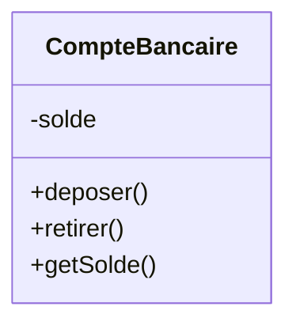
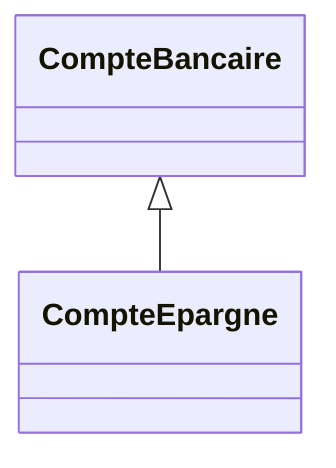
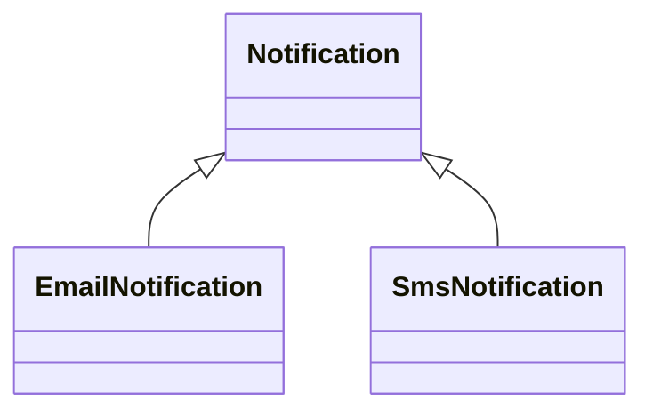
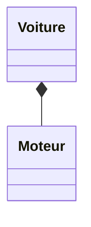

# Programmation Orientée Objet (POO) en PHP

## Introduction générale

Lorsque l’on débute en PHP, l’approche procédurale est souvent la première rencontrée. Elle consiste à écrire une suite d’instructions et de fonctions qui manipulent des variables et des tableaux. Cette manière de programmer est simple, directe, et parfaitement adaptée à de petits scripts ou à des exercices d’apprentissage.

Cependant, dès que le projet grandit, que le nombre de fonctionnalités augmente, ou que plusieurs développeurs travaillent sur le même code, le procédural atteint rapidement ses limites. Le code devient difficile à lire, complexe à maintenir, et risqué à modifier.

La Programmation Orientée Objet (POO) propose une autre façon de penser et d’organiser le code. Elle repose sur l’idée de modéliser le programme autour d’objets, c’est-à-dire d’entités cohérentes qui regroupent à la fois des données et les comportements associés.

Ce document a pour objectif de t’expliquer en profondeur ce changement de paradigme, d’en montrer les bénéfices concrets, et de t’apprendre à écrire du code PHP orienté objet clair, structuré et maintenable.

---

## 1. Du procédural à la POO : un changement de logique

### 1.1 Le raisonnement procédural

En procédural, on pense en termes de tâches à exécuter :

- lire des données
- les transformer
- afficher un résultat

Les données sont souvent stockées dans des variables globales ou passées de fonction en fonction. Rien n’empêche qu’elles soient modifiées à n’importe quel endroit du programme.

Prenons un exemple simple : la gestion d’un solde bancaire.

```php
$solde = 100;

function deposer(&$solde, $montant) {
    if ($montant > 0) {
        $solde += $montant;
    }
}

function retirer(&$solde, $montant) {
    if ($montant > 0 && $montant <= $solde) {
        $solde -= $montant;
    }
}
```

Ce code fonctionne, mais plusieurs questions se posent :

- Qui garantit que `$solde` ne sera pas modifié directement ailleurs ?
- Où sont centralisées les règles métier ?
- Comment gérer plusieurs comptes sans dupliquer le code ?

Ces problèmes apparaissent très vite dans un projet réel.

---

### 1.2 Le raisonnement orienté objet

En POO, on change complètement de point de vue. On ne se demande plus uniquement quelles actions effectuer, mais quels sont les objets du système et ce qu’ils savent faire.

Un **objet** est une entité autonome qui :

- possède un état (des données internes)
- expose des comportements (des méthodes)
- contrôle la manière dont son état peut être modifié

Cela permet de structurer le code autour de concepts clairs et cohérents.

---

## 2. Classes et objets : structurer le code

Une **classe** est un plan, une description abstraite.
Un **objet** est une instance concrète de cette classe.

### Exemple

```php
<?php
declare(strict_types=1);

class CompteBancaire
{
    private float $solde = 0;

    public function deposer(float $montant): void
    {
        if ($montant > 0) {
            $this->solde += $montant;
        }
    }

    public function retirer(float $montant): void
    {
        if ($montant > 0 && $montant <= $this->solde) {
            $this->solde -= $montant;
        }
    }

    public function getSolde(): float
    {
        return $this->solde;
    }
}

$compte = new CompteBancaire();
$compte->deposer(100);
$compte->retirer(40);

echo $compte->getSolde();
```

Ici, le solde n’est plus une variable libre. Il appartient à l’objet. Toute modification passe obligatoirement par une méthode définie par la classe.

C’est un gain énorme en termes de sécurité et de lisibilité. 

---

## 3. Encapsulation : protéger les données

L’encapsulation consiste à cacher l’état interne d’un objet et à n’autoriser son accès qu’à travers des méthodes bien définies.

Dans l’exemple précédent, la propriété `$solde` est déclarée `private`. Cela signifie qu’elle ne peut pas être modifiée directement depuis l’extérieur de la classe.

### Pourquoi c’est fondamental

Dans une application réelle :

- les données viennent d’utilisateurs
- elles peuvent être invalides ou malveillantes
- les règles métier doivent être respectées en permanence

L’encapsulation garantit que ces règles sont appliquées au bon endroit et de manière cohérente.

### Schéma conceptuel



---

## 4. Héritage : factoriser le comportement

L’héritage permet de créer une nouvelle classe à partir d’une classe existante. La classe enfant hérite des propriétés et méthodes de la classe parente.

### Cas concret

Imaginons différents types de comptes bancaires.

```php
class CompteBancaire
{
    protected float $solde = 0;

    public function deposer(float $montant): void
    {
        if ($montant > 0) {
            $this->solde += $montant;
        }
    }

    public function retirer(float $montant): void
    {
        if ($montant > 0 && $montant <= $this->solde) {
            $this->solde -= $montant;
        }
    }
}

class CompteEpargne extends CompteBancaire
{
    public function retirer(float $montant): void
    {
        if ($montant <= 1000) {
            parent::retirer($montant);
        }
    }
}
```

La logique commune est centralisée dans la classe parente, tandis que les règles spécifiques sont définies dans la classe enfant.

### Schéma



---

## 5. Polymorphisme : écrire du code générique

Le polymorphisme permet de manipuler des objets différents de manière uniforme, tant qu’ils partagent un même comportement.

### Exemple concret

```php
abstract class Notification
{
    abstract public function envoyer(string $message): void;
}

class EmailNotification extends Notification
{
    public function envoyer(string $message): void
    {
        echo "Email : $message\n";
    }
}

class SmsNotification extends Notification
{
    public function envoyer(string $message): void
    {
        echo "SMS : $message\n";
    }
}
```

Utilisation :

```php
$notifications = [
    new EmailNotification(),
    new SmsNotification()
];

foreach ($notifications as $notification) {
    $notification->envoyer("Paiement reçu");
}
```

Le code appelant n’a pas besoin de connaître le type exact de notification. Il sait simplement qu’elle peut envoyer un message.

### Schéma



---

## 6. Abstraction : définir des contrats

Une classe abstraite définit une structure commune sans fournir forcément l’implémentation complète.

Elle permet de dire : « toute classe qui hérite de moi doit respecter ce comportement ».

```php
abstract class Exporteur
{
    abstract public function exporter(array $donnees): string;
}
```

Cela garantit une cohérence dans le code et évite les implémentations incohérentes.

---

## 7. Composition : assembler des objets

La composition consiste à utiliser un objet à l’intérieur d’un autre objet, plutôt que d’hériter de lui.

```php
class Moteur
{
    public function demarrer(): void
    {
        echo "Moteur démarré\n";
    }
}

class Voiture
{
    public function __construct(private Moteur $moteur) {}

    public function demarrer(): void
    {
        $this->moteur->demarrer();
        echo "La voiture roule\n";
    }
}
```

### Schéma



La composition est souvent préférable à l’héritage car elle offre plus de flexibilité et moins de dépendances rigides.

---

## 8. Erreurs fréquentes en POO chez les débutants

Cette partie est volontairement longue et explicative. Les erreurs présentées ici ne sont pas des fautes graves, mais des **étapes normales dans l’apprentissage**. Les identifier tôt permet de progresser beaucoup plus vite.

### 8.1 Confondre POO et simple syntaxe `class`

Une erreur très fréquente consiste à croire que l’on fait de la POO dès que l’on utilise le mot-clé `class`.

Exemple typique :

```php
class Utilisateur {
    public string $nom;
    public string $email;
}
```

Puis ailleurs :

```php
$user = new Utilisateur();
$user->nom = $_POST['nom'];
$user->email = $_POST['email'];
```

Ici, la classe n’apporte **aucune valeur ajoutée** par rapport à un tableau associatif. Les données sont publiques, non contrôlées, et aucune règle métier n’est appliquée.

La POO ne consiste pas à stocker des données dans une classe, mais à **encapsuler un comportement cohérent**.

---

### 8.2 Tout mettre en `public`

Beaucoup de débutants rendent toutes les propriétés publiques « pour aller plus vite ».

Cela casse immédiatement l’encapsulation et rend impossible le contrôle de l’état interne de l’objet.

Règle simple à retenir :

- propriétés : `private` par défaut
- méthodes : `public` uniquement si elles font partie de l’API de l’objet

---

### 8.3 Dupliquer du code au lieu d’utiliser l’héritage ou la composition

En procédural, la duplication est courante. En POO, elle devient rapidement un problème majeur.

Si deux classes contiennent du code très similaire, c’est souvent le signe qu’un comportement commun doit être factorisé.

Attention cependant : l’héritage n’est pas toujours la solution. Dans de nombreux cas, la **composition** est préférable.

---

### 8.4 Utiliser l’héritage là où il n’y a pas de relation logique

Une erreur classique est de faire hériter une classe simplement pour réutiliser du code.

Par exemple :

```php
class Voiture extends Moteur {}
```

Conceptuellement, une voiture **n’est pas** un moteur. Elle **a** un moteur.

Cela doit conduire à une composition et non à un héritage.

---

### 8.5 Écrire des méthodes trop longues

Une méthode POO efficace est courte et lisible.

Si une méthode dépasse 30 à 40 lignes, c’est souvent un signal d’alerte indiquant que plusieurs responsabilités sont mélangées.

---

### 8.6 Mélanger logique métier et affichage

Même sans MVC, il est important de ne pas écrire du HTML dans les méthodes métier.

Une classe métier ne devrait jamais faire de `echo` dans un contexte réel. Elle retourne des données, et c’est le code appelant qui décide de l’affichage.

---

## 9. Progression d’exercices pratiques (avec corrigés)

Les exercices suivants sont conçus pour accompagner progressivement l’apprentissage des concepts présentés dans ce cours. Chaque exercice introduit une difficulté supplémentaire.

---

### Exercice 1 – Première classe et objet

**Objectif** : comprendre la notion de classe et d’objet.

Consigne :

- Créer une classe `Utilisateur`
- Propriétés privées : nom, email
- Constructeur pour initialiser ces propriétés
- Méthodes publiques `getNom()` et `getEmail()`

---

### Exercice 2 – Encapsulation et règles métier

**Objectif** : protéger l’état interne d’un objet.

Consigne :

- Créer une classe `Produit`
- Propriétés privées : nom, prix
- Interdire un prix négatif

---

### Exercice 3 – Héritage

**Objectif** : factoriser un comportement commun.

Consigne :

- Classe `Compte`
- Classe `ComptePremium` avec plafond de retrait plus élevé

---

### Exercice 4 – Polymorphisme

**Objectif** : utiliser des objets différents via une interface commune.
[Voir les interfaces ici](https://www.php.net/manual/fr/language.oop5.interfaces.php)
Consigne :

- Interface `MoyenPaiement`
- Classes `CarteBancaire`, `Paypal`

---

### Exercice 5 – Composition

**Objectif** : préférer l’assemblage d’objets à l’héritage.

Consigne :

- Classe `Commande`
- Utilise un objet `MoyenPaiement`

---

## Conclusion générale

La Programmation Orientée Objet n’est pas une contrainte supplémentaire, mais un outil puissant pour structurer le code, éviter les erreurs, et rendre les applications maintenables sur le long terme.

En PHP, la POO est aujourd’hui incontournable. Elle constitue la base des frameworks modernes et des architectures professionnelles.

Comprendre ces concepts en profondeur permet non seulement d’écrire un meilleur code, mais aussi de raisonner comme un développeur confirmé.
