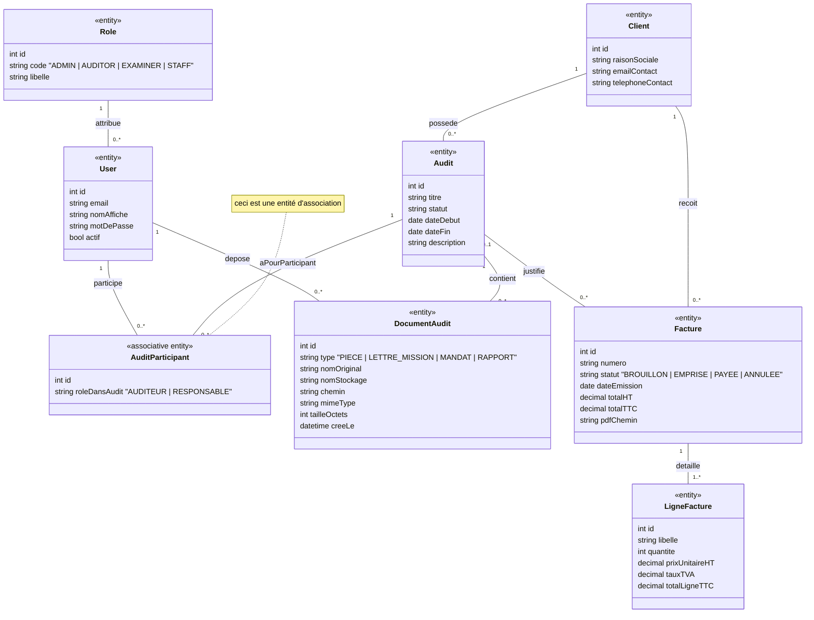

# MCD Cassandre au format MermaidJS

```mermaid
classDiagram

%% ======= Entities =======

class Role {
   <<entity>>
   int id
   string code "ADMIN | AUDITOR | EXAMINER | STAFF"
   string libelle
}

class User {
   <<entity>>
   int id
   string email
   string nomAffiche
   string motDePasse
   bool actif
}

class Client {
   <<entity>>
   int id
   string raisonSociale
   string emailContact
   string telephoneContact
}

class AuditParticipant {
   <<associative entity>>
   int id
   string roleDansAudit  "AUDITEUR | RESPONSABLE"
}
note for AuditParticipant "ceci est une entité d'association"

class Audit {
   <<entity>>
   int id
   string titre
   string statut
   date dateDebut
   date dateFin
   string description
}

class DocumentAudit {
   <<entity>>
   int id
   string type "PIECE | LETTRE_MISSION | MANDAT | RAPPORT"
   string nomOriginal
   string nomStockage
   string chemin
   string mimeType
   int tailleOctets
   datetime creeLe
}

class Facture {
   <<entity>>
   int id
   string numero
   string statut "BROUILLON | EMPRISE | PAYEE | ANNULEE"
   date dateEmission
   decimal totalHT
   decimal totalTTC
   string pdfChemin
}

class LigneFacture {
   <<entity>>
   int id
   string libelle
   int quantite
   decimal prixUnitaireHT
   decimal tauxTVA
   decimal totalLigneTTC
}

%% ======= Relations =======

Role  "1" -- "0..*" User : attribue
Client "1" -- "0..*" Audit : possede

Audit "1" -- "0..*" AuditParticipant : aPourParticipant
User "1" -- "0..*" AuditParticipant : participe

Audit "1" -- "0..*" DocumentAudit : contient
User  "1" -- "0..*" DocumentAudit : depose

Client "1" -- "0..*" Facture : recoit
Audit  "0..1" -- "0..*" Facture : justifie
Facture "1" -- "1..*" LigneFacture : detaille
```
