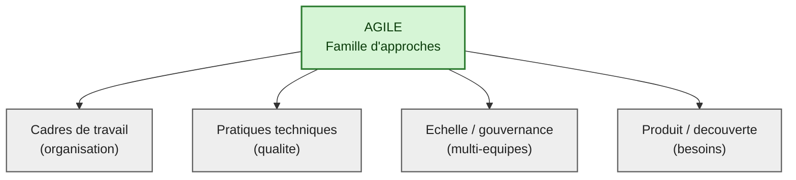
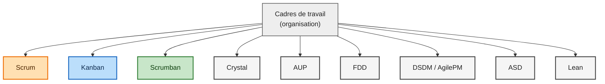
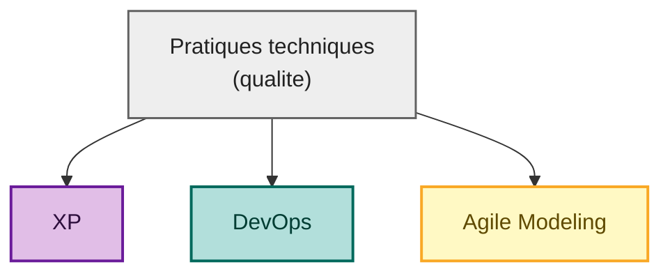
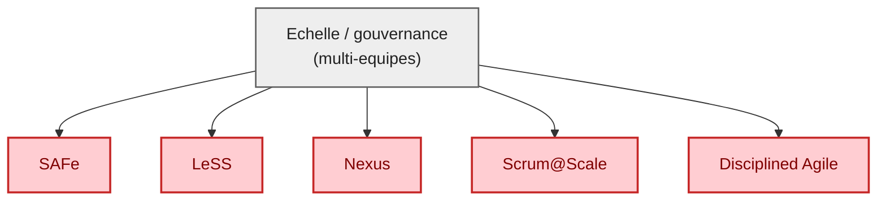
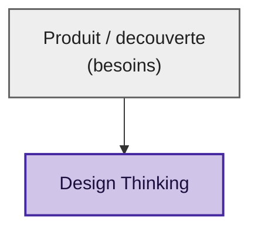

# Les Méthodes Agiles

Agile n’est pas une seule méthode. On parle plutot d’un ensemble d’approches qui partagent une idée commune: avancer par petites étapes, obtenir du retour rapidement, puis s’adapter. L’objectif n’est pas de suivre un plan figé, mais de construire un chemin qui reste cohérent quand le contexte change. Ce point est important, parce que l’agilité est souvent réduite à un vocabulaire ou à une cérémonie. Or, ce qui compte n’est pas l’étiquette. Ce qui compte, c’est la capacité à faire progresser un produit tout en gardant une qualité suffisante pour continuer demain.

## Agile en 6 points

Pour garder l’essentiel en tête, on peut s’appuyer sur six idées simples. Elles ne décrivent pas une méthode précise: elles décrivent la direction que prennent la plupart des démarches agiles quand elles fonctionnent.

* Livrer tôt et souvent quelque chose qui fonctionne (même petit)
* Prioriser la valeur (le plus utile d’abord)
* Découper le travail en tâches finissables
* Rendre le travail visible (board, critères, Done)
* Obtenir du feedback (client, formateur, équipe)
* S’améliorer régulièrement (rétro + 1 action)

Ces six idées ont une conséquence directe: on ne cherche pas d’abord à “remplir un planning”. On cherche d’abord à produire des incréments stables, à apprendre, et à corriger la trajectoire.

## Vocabulaire minimal

Les méthodes agiles utilisent un vocabulaire simple, mais précis. Le comprendre permet de lire et d’écrire des processus sans malentendu.

* **Backlog**: liste priorisée des choses à faire
* **User story**: besoin exprimé côté utilisateur
* **Critères d’acceptation**: comment on sait que c’est réussi (testable)
* **WIP**: travail en cours (à limiter)
* **Definition of Done (DoD)**: conditions pour dire “terminé”
* **Incrément**: une version qui tourne (même simple)

Le point le plus décisif dans cette liste est souvent la DoD. Tant qu’on ne sait pas clairement ce que “terminé” signifie, on croit avancer alors qu’on accumule du “presque fini”. L’agilité ne consiste pas seulement à commencer des choses. Elle consiste à finir souvent, et proprement.

---

## Panorama des approches

Agile rassemble des cadres de travail, des pratiques techniques, des approches orientées produit, et des manières d’organiser la coordination quand plusieurs équipes travaillent ensemble. Le tableau suivant sert de repère: il permet d’identifier à quoi sert chaque approche, quand on l’utilise, et quels risques apparaissent le plus souvent.

| Approche                    | A quoi ça sert                                                          | Quand l’utiliser                                                  | Risques fréquents                                                                            |
| --------------------------- | ----------------------------------------------------------------------- | ----------------------------------------------------------------- | -------------------------------------------------------------------------------------------- |
| Scrum                       | Avancer par itérations courtes avec objectif clair et feedback régulier | Equipe stable, besoin de cadence, produit évolutif                | Scrum de façade (réunions sans transparence), interruptions constantes, backlog non priorisé |
| Kanban                      | Optimiser un flux continu (support, corrections, demandes variées)      | Beaucoup d’imprévus, tickets de tailles variables, maintenance    | Trop de WIP, pas de priorités, pas de temps dédié à l’amélioration                           |
| Scrumban                    | Scrum allégé + flux Kanban (souvent le plus réaliste)                   | Transition vers agile, équipes qui veulent un minimum de rituels  | Devient “tout et n’importe quoi” si règles floues (WIP, DoD, priorités)                      |
| XP (Extreme Programming)    | Qualité technique forte (tests, refactor, intégration)                  | Projet à risque technique, besoin de fiabilité, dette à maîtriser | Demande discipline et temps, rejet si pression délai, “tests plus tard”                      |
| Lean Software Development   | Réduire gaspillage, améliorer le débit, livrer plus vite                | Organisation qui veut optimiser process et temps de cycle         | Prétexte à “faire plus avec moins” sans qualité ni humain                                    |
| Crystal                     | Adapter la méthode à la taille et criticité, centré communication       | Petites équipes, contexte variable, besoin de souplesse           | Trop informel, manque de repères si l’équipe débute                                          |
| DSDM / AgilePM              | Agile orienté projet avec gouvernance, timeboxing                       | Cadre, jalons, engagement de livraison                            | Peut redevenir “gestion de projet lourde”, focus documents                                   |
| FDD (Feature-Driven Dev)    | Livrer par fonctionnalités, structurer conception et build              | Domaine métier vaste, besoin d’architecture et suivi par features | Sur-conception, moins adapté aux changements rapides                                         |
| ASD (Adaptive Software Dev) | Approche exploratoire, apprendre et s’adapter                           | Forte incertitude, innovation, découverte produit                 | Flou si pas de garde-fous, dérive “on improvise”                                             |
| AUP (Agile Unified Process) | Itératif mais plus structuré (modélisation légère, discipline)          | Besoin de structure, doc minimale, architecture                   | Retombe vite en process “semi-lourd”                                                         |
| SAFe (agile à l’échelle)    | Coordonner beaucoup d’équipes et programmes                             | Grandes organisations multi-équipes                               | Bureaucratie, coûts, perte d’agilité, “agile theater”                                        |
| LeSS / Nexus / Scrum@Scale  | Scrum à l’échelle plus léger que SAFe                                   | Plusieurs équipes sur 1 produit                                   | Coordination difficile, dépendances, nécessite maturité et transparence                      |
| DevOps (culture/pratiques)  | Livrer plus souvent et plus sûrement (CI/CD, automatisation)            | Réduire frictions dev-run, fiabiliser livraisons                  | Outillage sans changement de culture, surcharge outils                                       |
| Design Thinking             | Clarifier le problème, explorer solutions, prototyper                   | Début de produit, besoins flous, UX importante                    | Trop de “post-it” sans réalisation                                                           |
| Agile Modeling              | Modéliser juste assez, au bon moment (UML, MCD, schémas)                | Documenter sans se noyer                                          | Sur-doc, modèles jamais maintenus, ou absence totale de modèle                               |

Ce panorama permet une lecture plus fine que “Scrum ou Kanban”. On peut déjà y voir une idée structurante: un cadre d’organisation (Scrum, Kanban, Scrumban) ne suffit pas à lui seul. La qualité technique (XP) et la livraison (DevOps) déterminent souvent si l’agilité tient dans la durée. De meme, quand le besoin est flou, la découverte (Design Thinking) évite de construire vite… mais à coté.

---

## Comment choisir

On peut choisir sans se perdre en théorie, en regardant la nature du travail. Quand la réalité est faite d’imprévus, de demandes courtes, de maintenance, de tickets variés, un pilotage par flux est souvent plus stable. Quand le contexte est plus “produit”, avec une équipe relativement stable et un besoin de cadence, un pilotage par itérations devient plus naturel. Quand le risque principal est technique (bugs, dette, instabilité), la discipline XP devient la garantie de survie. Enfin, quand on ne sait pas encore quoi construire, on commence par clarifier le problème, puis on revient à un backlog.

* Beaucoup d’imprévus, de demandes variées -> **Kanban**
* Equipe stable, besoin de cadence et de jalons -> **Scrum** (ou **Scrumban**)
* Projet fragile techniquement (risque de bugs/dette) -> **XP** (avec Scrum ou Kanban)
* Besoin très flou, on ne sait pas quoi construire -> **Design Thinking** puis backlog

Même si ce bloc ressemble à un résumé, il est utile comme boussole: on choisit d’abord en fonction du type de problème, pas en fonction de la popularité d’un mot.

---

## Ce que l’agile ne garantit pas

L’agilité est une aide, pas une promesse. Elle ne “fait pas gagner du temps” par magie: si le besoin est flou, il restera difficile. Elle ne remplace ni les compétences techniques ni une architecture correcte. Elle n’empêche pas les imprévus: elle les rend visibles et gérables. Enfin, sans transparence minimale, Scrum se transforme facilement en une série de réunions qui n’augmente pas la capacité à livrer.

* L’agile ne “fait pas gagner du temps” par magie: si le besoin est flou, ça restera difficile.
* L’agile ne remplace pas les compétences techniques ou une architecture correcte.
* L’agile n’empêche pas les imprévus: il les rend visibles et gérables.
* Sans transparence minimale, Scrum devient souvent une série de réunions.

Ce passage est un garde-fou. Il permet d’éviter l’“agile theater”: l’apparence de l’agilité sans ses effets.

---

## La clé pour que ça marche: DoD + règles d’équipe

On peut avoir un backlog, un board, des sprints, des réunions, et malgré tout ne pas progresser. Le point qui distingue le plus souvent un système qui tient d’un système qui s’épuise tient dans une phrase: on sait ce que “Done” veut dire, et on se met d’accord sur quelques règles de fonctionnement.

### Definition of Done

La DoD n’est pas un formulaire administratif. C’est une protection contre le “presque fini”. Elle permet d’éviter qu’un gain immédiat se transforme en dette invisible. Dans un contexte technique, elle sert surtout à rendre la qualité discutable sur des critères observables.

Une tâche est “Done” si:

* la fonctionnalité fonctionne en local
* les critères d’acceptation sont respectés
* le code est relu (au moins 1 pair)
* pas de debug oublié (dump, dd, var_dump)
* doc mise à jour si nécessaire (README / docs)

### Règles d’équipe (Working Agreement)

On parle parfois de “Working Agreement” pour désigner un accord de fonctionnement. Il ne s’agit pas de multiplier les règles, mais de rendre explicites quelques habitudes qui empêchent la dérive: trop de travail en parallèle, des tâches trop grosses, et une confusion permanente sur l’état réel du travail.

* 1 tâche “en cours” max par personne (limite WIP)
* on met à jour le board à chaque changement
* si une tâche dépasse 1-2 jours, on la découpe
* on n’annonce pas “fini” sans vérification

---

## Exemple concret (Cassandre - MVP en 6 cartes)

Les méthodes deviennent plus lisibles quand on les relie à un objectif concret. Ici, l’idée est de produire une version minimale utilisable et démontrable. L’intérêt d’un MVP n’est pas de “faire petit” par principe, mais de raccourcir le cycle entre décision et preuve: on obtient rapidement une version qui tourne, on observe, puis on itère.

Objectif: livrer une version minimale utilisable (et démontrable).

* Authentification + rôles simples
* CRUD Client
* CRUD Audit
* Upload documents d’audit
* Liste avec pagination (Client ou Audit)
* Back-office EasyAdmin minimal (optionnel)

Exemple de carte (format simple):

* **Titre**: CRUD Client - création

* **Critères d’acceptation**:
  
  * formulaire création disponible
  * validations des champs obligatoires
  * redirection vers fiche client après création

---

## Les familles d’approches

Pour s’y retrouver sans se perdre, on peut classer les approches en familles. Cette classification sert à éviter une erreur fréquente: demander à un cadre d’organisation (Scrum) de résoudre un probleme technique (qualité), ou demander à une pratique technique (tests) de résoudre un probleme de priorisation.

### Cadres de travail (organisation)

Les cadres de travail sont des façons concrètes d’organiser le suivi: comment on transforme un besoin en tâches, comment on suit l’avancement, comment on se coordonne. Ils structurent la circulation de l’information et la prise de décision.

### Pratiques techniques (qualité)

Les pratiques techniques sont les habitudes qui rendent le travail fiable: tests, revues de code, intégration continue, documentation, refactor. Sans elles, une organisation peut paraitre efficace pendant quelques semaines puis se gripper: le coût du changement augmente, les régressions se multiplient, les livraisons deviennent risquées.

### Echelle / gouvernance (multi-equipes)

Quand plusieurs équipes travaillent sur un même produit, la coordination devient un sujet à part entière. Les cadres “à l’échelle” ajoutent une organisation commune pour garder de la cohérence, mais introduisent aussi de la complexité. Leur intérêt dépend surtout de la maturité et du besoin réel de synchronisation.

### Produit / découverte (besoins)

Enfin, certaines approches servent surtout à comprendre le besoin. Elles évitent de construire rapidement une solution élégante… pour un probleme mal posé. On les utilise surtout au début d’un produit, ou quand une incertitude forte bloque les décisions.

---

## Ajout de cohérence: Scrum + XP, et la place de Scrumban

Le panorama aide à comprendre une idée simple: Scrum organise le travail, XP protège la qualité. Cette combinaison est souvent suffisante pour construire un système stable. Cependant, dès que le flux d’interruptions devient dominant, Scrum “pur” se heurte au réel. Dans ce cas, Scrumban agit comme une zone d’équilibre: on conserve la visibilité, la DoD, et un minimum de repères, mais on accepte de piloter le travail comme un flux. Kanban devient pertinent quand la maintenance et les tickets deviennent la norme.

Ce point n’ajoute pas une nouvelle méthode. Il donne une lecture de continuité: on garde les memes exigences (visibilité, finition, qualité), et on ajuste seulement la manière de piloter le flux.
