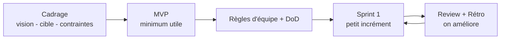

# Fiche A - Démarrer en Scrum (cadrage, MVP, règles d’équipe)

## Idée générale

Scrum aide à avancer sur un projet complexe sans prétendre tout prévoir au départ. On travaille par cycles courts (les sprints), on livre un petit résultat utilisable, puis on ajuste. Le démarrage sert à éviter le flou: on clarifie le sens du projet, on choisit une première cible réaliste (MVP), et on se met d’accord sur la façon de travailler ensemble.

## Cadrage express

Cadrer, c’est répondre simplement à: “pourquoi on le fait, pour qui, et comment on saura que ça marche”. On vise des phrases courtes, pas un roman. On note aussi les contraintes qui pèsent vraiment (temps, sécurité, accessibilité, données personnelles), car elles influencent les choix techniques.

## MVP

Le MVP (Minimum Viable Product) est la plus petite version qui apporte déjà une valeur. Ce n’est pas une maquette: c’est une version minimale utile. Le MVP sert à apprendre vite. Si on se trompe, on se trompe tôt et pas après des semaines de travail.

## Règles d’équipe et DoD

Les règles d’équipe évitent les conflits invisibles. Elles disent comment on communique, comment on décide, comment on s’organise quand on est bloqué. La DoD (Definition of Done) fixe ce que “terminé” veut dire au niveau de l’équipe: code intégré, relu, testable et documenté si nécessaire.

### Encadré vocabulaire

* **Sprint**: période courte (souvent 1-2 semaines) avec un objectif clair.
* **Incrément**: petit morceau du produit réellement utilisable.
* **DoD (Definition of Done)**: conditions minimales pour dire “c’est vraiment fini”.

### Mini exemple Cassandre

On cadre Cassandre ainsi: “permettre à un utilisateur de se connecter et d’accéder à son espace”. Le MVP pourrait être: inscription, connexion, une page profil basique. Les règles d’équipe incluent par exemple: “on passe par des Issues”, “on relit toute PR”. La DoD inclut: “la fonctionnalité marche”, “la PR est relue”, “aucun secret dans le dépôt”.

