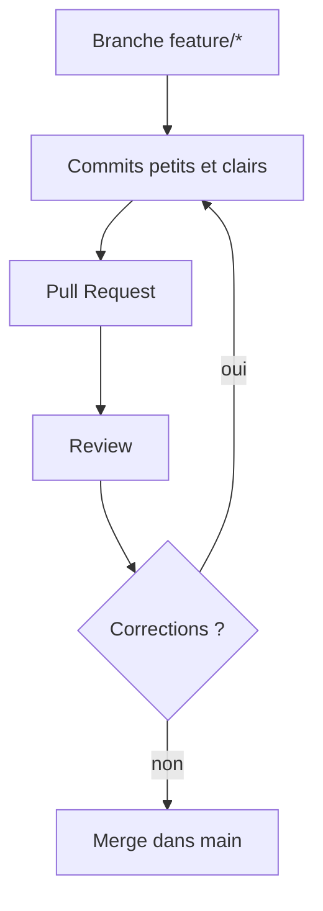

# Fiche C - Collaboration et qualité (PR, documentation, conventions de commits)

## Idée générale

Dans un projet à plusieurs, la qualité sert à protéger le temps et la confiance de l’équipe. On ne cherche pas la perfection, on cherche un niveau de fiabilité suffisant pour avancer sans peur. Le moyen le plus simple pour ça, c’est de travailler en branches et d’intégrer via Pull Requests relues.

## Branches et Pull Requests

Une branche est un espace de travail isolé. On y fait un changement sans toucher directement à la branche principale. Quand le changement est prêt, on ouvre une Pull Request (PR). La PR est une demande d’intégration: on montre ce qu’on a fait, on explique, et on demande une relecture.

## Revue de code (review)

Relire une PR, c’est vérifier trois choses: le besoin est couvert, le code reste compréhensible, et on ne met pas le projet en danger (tests, régressions, sécurité basique). La review doit rester constructive: on critique le code, pas les personnes.

## Documentation et commits

La documentation minimale évite de réexpliquer sans cesse. Un README suffit souvent pour démarrer: installation, lancement, variables d’environnement. Les conventions de commits rendent l’historique lisible. Un message de commit doit dire ce qui a été fait en termes simples.

### Encadré vocabulaire

* **Branche**: copie de travail isolée.
* **PR (Pull Request)**: demande d’intégration d’un changement.
* **Review**: relecture pour améliorer et sécuriser.
* **Commit**: petite étape enregistrée avec un message clair.

### Mini exemple Cassandre

On crée une branche `feature/login`. On code le formulaire de connexion, on écrit un test minimal ou on décrit un test manuel. On ouvre une PR “Login utilisateur” liée à l’Issue. La PR est relue, puis merge. On met à jour le README si une variable d’environnement a été ajoutée.

