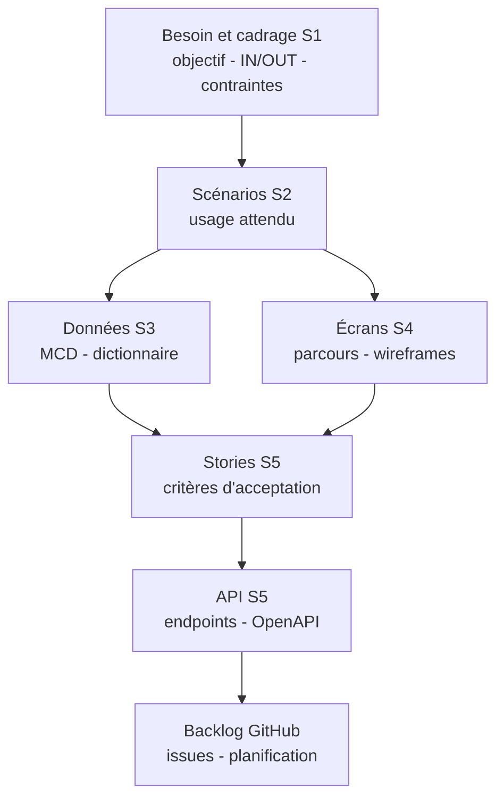

# Analyser le CDCF(cahier des charges fonctionnel), recueillir le besoin et cadrer le périmètre

## 1) Pourquoi on commence par là

Avant de dessiner des écrans, modéliser des données ou écrire une API, on doit savoir exactement **ce qu’on cherche à résoudre**. Un projet échoue rarement parce qu’on ne sait pas coder. Il échoue plus souvent parce que le besoin est flou, que le périmètre change sans arrêt, ou que les règles métier ne sont pas explicites.

Cette séquence sert à poser une base claire et partagée, qui servira ensuite à:

* écrire des scénarios (S2),
* structurer les données (S3),
* concevoir les écrans (S4),
* préparer les stories et l’API (S5).

## 2) Ce qu’on appelle CDCF ici (version simple)

On ne vise pas un document long. Ici, un CDCF simplifié est une fiche courte qui permet de répondre à:

* Pourquoi on fait le projet ?
* Pour qui ?
* Qu’est-ce qu’on livre en première version utile ?
* Qu’est-ce qu’on exclut volontairement ?
* Quelles contraintes on doit respecter ?
* Comment on saura que c’est réussi ?

L’objectif est d’éviter les malentendus, pas de produire de la paperasse.

## 3) Cadrage express: structure recommandée

On construit une fiche qui se lit en 2 minutes.

### Contexte

On décrit en 3-5 lignes la situation actuelle et le déclencheur du projet.

### Objectif produit (une phrase)

On formule: **“Permettre à … de … afin de …”**
Cette phrase doit rester compréhensible par un non technicien.

### Utilisateurs et parties prenantes

On liste les profils concernés (utilisateur, admin, support, direction, service externe).
Un “acteur” dans le besoin, ce n’est pas forcément une personne, ça peut être un système.

### Périmètre IN/OUT

On fixe la frontière du projet.

* **IN**: ce que la version visée fait vraiment.
* **OUT**: ce qu’on ne fait pas, même si c’est tentant.

Le OUT n’est pas négatif. Il protège la réussite.

### Exigences et contraintes

On sépare deux familles.

**Exigences fonctionnelles**: ce que l’application doit permettre de faire (actions, règles métier, parcours).
**Exigences non fonctionnelles**: ce qui encadre la qualité, par exemple:

* sécurité (authentification, droits, mots de passe),
* RGPD (données personnelles minimales, traçabilité, suppression),
* accessibilité (navigation clavier, contrastes, messages),
* performance (temps de réponse acceptable),
* maintenabilité (code lisible, conventions, documentation minimale).

### Hypothèses et risques

Une hypothèse est une supposition (“on suppose que…”).
Un risque est ce qui peut faire dérailler le projet (“si … alors …”).
On ne cherche pas à tout prévoir, on cherche à repérer ce qui est dangereux tôt.

### Critères de réussite

On écrit 2 à 5 conditions simples qui permettent de dire “c’est réussi”.
Exemple: “on peut créer un compte et se connecter”, “les erreurs principales sont gérées”, “aucune donnée sensible n’est stockée inutilement”.

## 4) Recueillir le besoin (sans partir sur la solution)

Le recueil du besoin consiste à comprendre le problème avant de proposer une réponse. On évite de parler de technologie trop tôt.

Questions qui marchent bien:

* Quel est le problème exact qu’on veut résoudre ?
* Qui le subit, et dans quelles situations ?
* Comment ça se passe aujourd’hui, étape par étape ?
* Qu’est-ce qui est lent, risqué, source d’erreurs ou de frustration ?
* Qu’est-ce qui est indispensable en V1 ?
* Quelles règles sont non négociables (légal, sécurité, RGPD) ?
* Quelles données sont sensibles ?

On termine par une reformulation écrite:
“Si on a bien compris, on veut … pour … afin de …, et on ne fait pas … en V1.”

## 5) Règles de gestion: formuler des phrases testables

Une règle de gestion décrit une contrainte métier. Elle est utile parce qu’elle se réutilise partout: scénarios, données, écrans, stories, API.

Format simple:
**RG-XX: [Sujet] doit/peut/ne doit pas [verbe] [condition].**

Une règle est bonne si:

* elle est compréhensible,
* elle est testable (on peut vérifier vrai ou faux),
* elle n’est pas ambiguë.

## 6) Traçabilité: comment tout s’enchaîne

Le cadrage S1 est le point de départ. Ensuite, on déroule logiquement.

## 7) Exemple sur le thème Cassandre

Objectif: permettre à un utilisateur de se connecter et d’accéder à un espace personnel.
IN (V1): inscription, connexion, profil, tableau de bord simple.
OUT (V1): paiement, messagerie, exports avancés.
Règles: e-mail unique, mot de passe minimal, gestion des tentatives de connexion.
Critères de réussite: on peut s’inscrire, se connecter, consulter son profil, se déconnecter.
