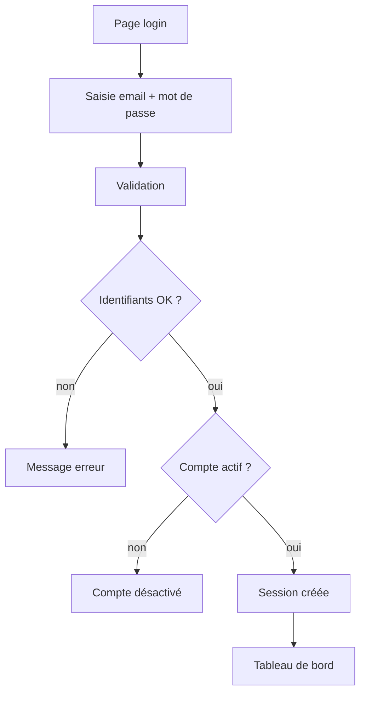

# Todo S3 - Scénarios + UML simples (fiche + mini TP + exemple Cassandre)

## Fiche de cours (S3)

Un **scénario** décrit une situation d’usage: qui fait quoi, dans quel ordre, et ce qui se passe en cas de problème. L’objectif est de rendre le besoin concret et vérifiable. On évite de parler technique. On décrit le parcours comme si on observait quelqu’un utiliser l’application.

On utilise des diagrammes UML simples pour représenter ces scénarios:

* Le **cas d’utilisation** montre les acteurs et les grandes actions possibles.
* Le **diagramme d’activité** montre le déroulement d’un scénario (y compris les alternatives).
  Ces diagrammes servent surtout à clarifier et à communiquer.

### Encadré vocabulaire

* **Acteur**: rôle qui interagit avec le système (utilisateur, admin, service externe).
* **Précondition**: ce qui doit être vrai avant le scénario.
* **Scénario nominal**: déroulement “normal”.
* **Alternative / erreur**: variante ou cas qui échoue.

## Mini TP (S3)

1. On choisit une fonctionnalité du MVP (ex: “se connecter”).

2. On écrit 1 scénario nominal en 6-10 étapes courtes.

3. On écrit 2 alternatives (ex: mauvais mot de passe, compte désactivé).

4. On produit:
   
   * 1 cas d’utilisation (acteurs + actions)
   * 1 diagramme d’activité du scénario “se connecter”

## Exemple Cassandre (S3)

**Scénario: Se connecter**

* Précondition: un compte existe.

* Nominal:
  
  1. On ouvre la page login.
  2. On saisit e-mail et mot de passe.
  3. On valide.
  4. Le système vérifie les identifiants.
  5. Le système crée une session.
  6. On arrive sur le tableau de bord.

* Alternative A: mot de passe incorrect -> message d’erreur.

* Alternative B: compte désactivé -> message + lien support.

