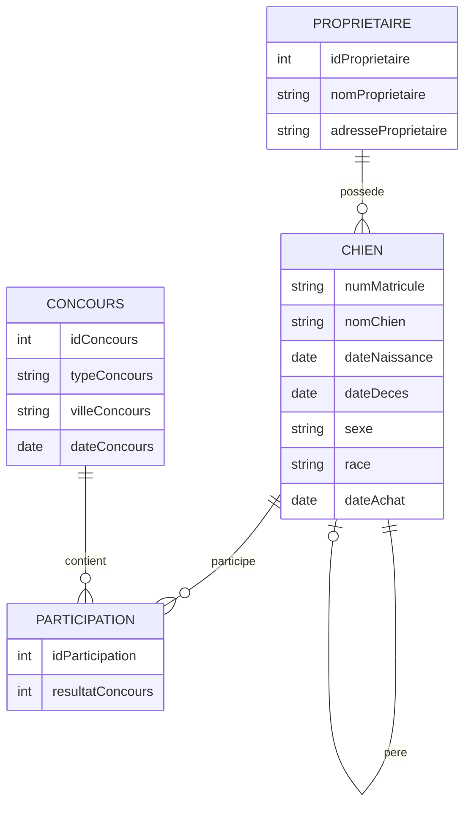

```mermaid
erDiagram
  PROPRIETAIRE {
    int idProprietaire
    string nomProprietaire
    string adresseProprietaire
  }

  CHIEN {
    string numMatricule
    string nomChien
    date dateNaissance
    date dateDeces
    string sexe
    string race
    date dateAchat
  }

  CONCOURS {
    int idConcours
    string typeConcours
    string villeConcours
    date dateConcours
  }

  PARTICIPATION {
    int idParticipation
    int resultatConcours
  }

  %% Hypothèse classique : un chien a un seul propriétaire (non précisé autrement).
  PROPRIETAIRE ||--o{ CHIEN : "possede"

  %% Un chien participe à plusieurs concours, un concours accueille plusieurs chiens
  CHIEN ||--o{ PARTICIPATION : "participe"
  CONCOURS ||--o{ PARTICIPATION : "contient"

  %% Généalogie : mère et père sont aussi des chiens
  CHIEN ||--o| CHIEN : "mere"
  CHIEN ||--o| CHIEN : "pere"

```