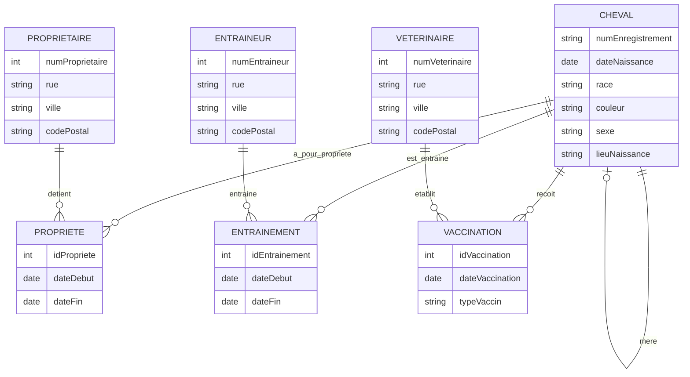

```mermaid
erDiagram
  CHEVAL {
    string numEnregistrement
    date dateNaissance
    string race
    string couleur
    string sexe
    string lieuNaissance
  }

  PROPRIETAIRE {
    int numProprietaire
    string rue
    string ville
    string codePostal
  }

  ENTRAINEUR {
    int numEntraineur
    string rue
    string ville
    string codePostal
  }

  VETERINAIRE {
    int numVeterinaire
    string rue
    string ville
    string codePostal
  }

  PROPRIETE {
    int idPropriete
    date dateDebut
    date dateFin
  }

  ENTRAINEMENT {
    int idEntrainement
    date dateDebut
    date dateFin
  }

  VACCINATION {
    int idVaccination
    date dateVaccination
    string typeVaccin
  }

  %% Généalogie : mère identifiée
  CHEVAL ||--o| CHEVAL : "mere"

  %% Propriété "à une date donnée" -> association temporelle
  CHEVAL ||--o{ PROPRIETE : "a_pour_propriete"
  PROPRIETAIRE ||--o{ PROPRIETE : "detient"

  %% Entraînement "à une date donnée" -> association temporelle
  CHEVAL ||--o{ ENTRAINEMENT : "est_entraine"
  ENTRAINEUR ||--o{ ENTRAINEMENT : "entraine"

  %% Suivi vétérinaire + vaccinations datées
  CHEVAL ||--o{ VACCINATION : "recoit"
  VETERINAIRE ||--o{ VACCINATION : "etablit"

```