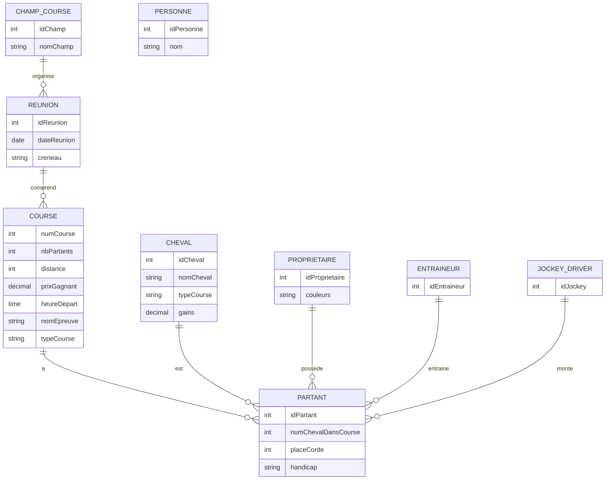

```mermaid
erDiagram
  CHAMP_COURSE {
    int idChamp
    string nomChamp
  }

  REUNION {
    int idReunion
    date dateReunion
    string creneau
  }

  COURSE {
    int numCourse
    int nbPartants
    int distance
    decimal prixGagnant
    time heureDepart
    string nomEpreuve
    string typeCourse
  }

  CHEVAL {
    int idCheval
    string nomCheval
    string typeCourse
    decimal gains
  }

  PERSONNE {
    int idPersonne
    string nom
  }

  PROPRIETAIRE {
    int idProprietaire
    string couleurs
  }

  ENTRAINEUR {
    int idEntraineur
  }

  JOCKEY_DRIVER {
    int idJockey
  }

  PARTANT {
    int idPartant
    int numChevalDansCourse
    int placeCorde
    string handicap
  }

  %% Champ -> réunions (max 2 par jour : règle à contrôler applicativement)
  CHAMP_COURSE ||--o{ REUNION : "organise"

  %% Réunion -> courses
  REUNION ||--o{ COURSE : "comprend"

  %% Course -> partants (min 5, max 25 : contrainte)
  COURSE ||--o{ PARTANT : "a"

  %% Partant -> cheval
  CHEVAL ||--o{ PARTANT : "est"

  %% Partant -> personnes (rôles)
  PROPRIETAIRE ||--o{ PARTANT : "possede"
  ENTRAINEUR ||--o{ PARTANT : "entraine"
  JOCKEY_DRIVER ||--o{ PARTANT : "monte"

  %% Remarques de règles :
  %% - Un jockey/driver peut monter plusieurs fois dans la même réunion -> OK via PARTANT
  %% - Un cheval peut courir plusieurs fois dans la semaine mais pas le même jour -> contrainte
  %% - Un propriétaire ou entraîneur peut avoir plusieurs chevaux dans la même épreuve -> OK

```