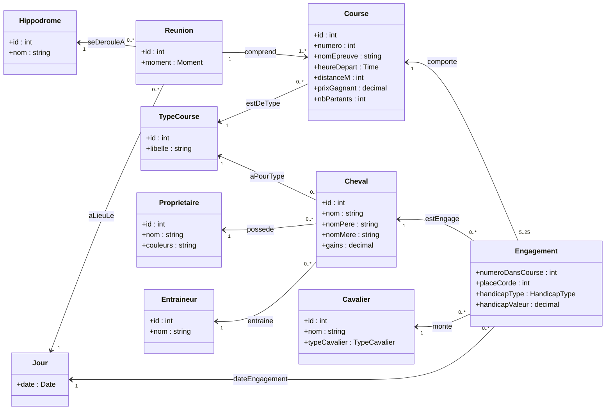

```mermaid
classDiagram
direction LR

class Jour {
  +date : Date
}

class Hippodrome {
  +id : int
  +nom : string
}

class Reunion {
  +id : int
  +moment : Moment
}

class Course {
  +id : int
  +numero : int
  +nomEpreuve : string
  +heureDepart : Time
  +distanceM : int
  +prixGagnant : decimal
  +nbPartants : int
}

class TypeCourse {
  +id : int
  +libelle : string
}

class Cheval {
  +id : int
  +nom : string
  +nomPere : string
  +nomMere : string
  +gains : decimal
}

class Proprietaire {
  +id : int
  +nom : string
  +couleurs : string
}

class Entraineur {
  +id : int
  +nom : string
}

class Cavalier {
  +id : int
  +nom : string
  +typeCavalier : TypeCavalier
}

class Engagement {
  +numeroDansCourse : int
  +placeCorde : int
  +handicapType : HandicapType
  +handicapValeur : decimal
}

Hippodrome "1" <-- "0..*" Reunion : seDerouleA
Jour "1" <-- "0..*" Reunion : aLieuLe

Reunion "1" --> "1..*" Course : comprend

TypeCourse "1" <-- "0..*" Course : estDeType
TypeCourse "1" <-- "0..*" Cheval : aPourType

Proprietaire "1" <-- "0..*" Cheval : possede
Entraineur "1" <-- "0..*" Cheval : entraine

Cheval "1" <-- "0..*" Engagement : estEngage
Course "1" <-- "5..25" Engagement : comporte
Cavalier "1" <-- "0..*" Engagement : monte
Jour "1" <-- "0..*" Engagement : dateEngagement

%% Contraintes (notes en commentaire Mermaid)
%% - max 2 reunions par hippodrome et par jour (moment APRES_MIDI ou NOCTURNE)
%% - un cheval ne peut pas etre engage plus d une fois le meme jour
%% - coherence: Engagement.jour = Course.reunion.jour
%% - coherence: Cheval.typeCourse = Course.typeCourse

```
