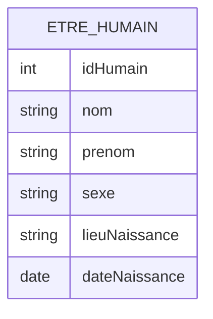
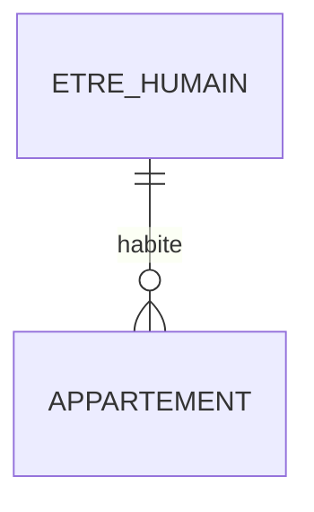
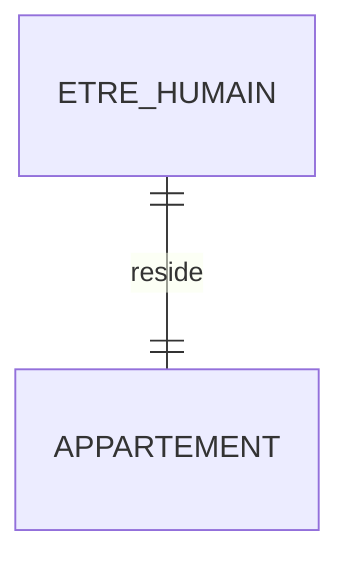
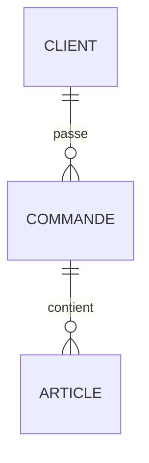
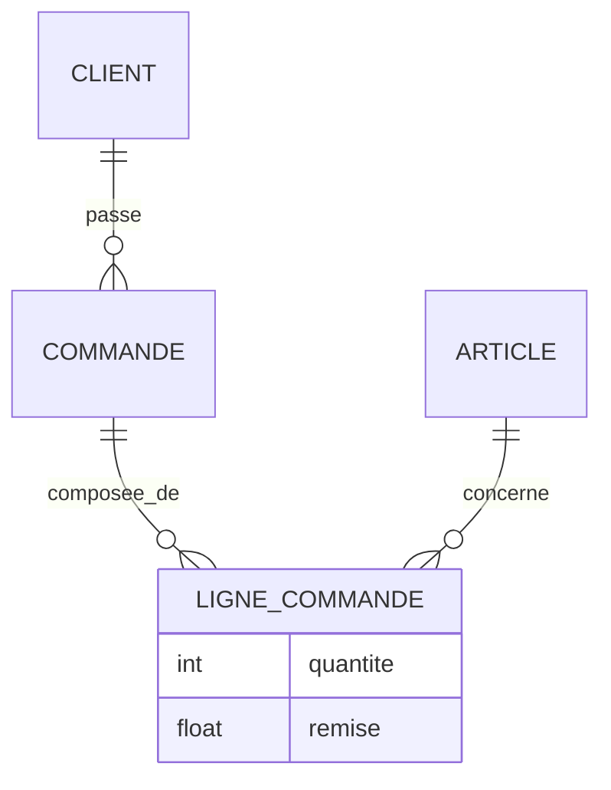
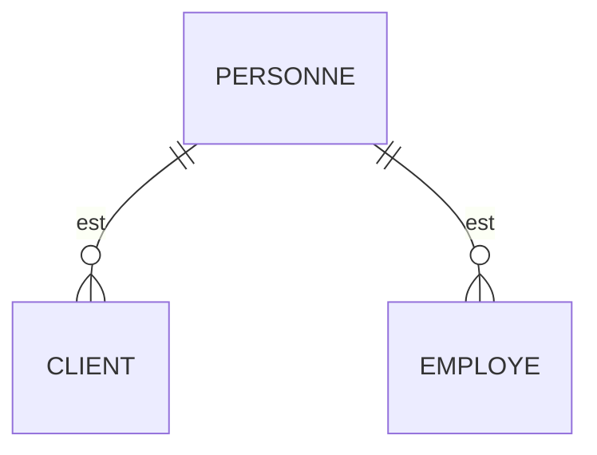

# Petit guide d’analyse des données

## Méthode MERISE

L’analyse des données constitue une étape incontournable de toute conception d’application reposant sur un SGBDR (Système de Gestion de Base de Données Relationnelle).

La méthode **MERISE**, fondée sur le **modèle entité-association**, est un outil d’analyse conceptuelle largement utilisé en France. Elle permet de raisonner sur les données indépendamment de toute considération technique ou logicielle.

---

## 1. Petite histoire de la méthode MERISE

Le modèle entité-association est apparu au début des années 1970, notamment à travers les travaux de chercheurs français (Moulin, Tardieu, Teboul) puis a été formalisé et popularisé par **Peter Chen** en 1976.

MERISE s’est imposée comme un **outil de communication** entre analystes, concepteurs et développeurs travaillant avec des bases relationnelles.

---

## 2. Éléments de base du modèle entité-association

Le modèle entité-association repose sur deux concepts fondamentaux :

* les **entités** ;
* les **associations** entre entités.

---

## 2.1 Les entités

Une **entité** est un regroupement cohérent d’informations décrivant un ensemble d’objets de même nature.

Exemples d’attributs pour l’entité *ÊTRE HUMAIN* :

* nom
* prénom
* date de naissance
* sexe
* lieu de naissance

### Représentation Mermaid

---

## 2.2 Les attributs

Les **attributs** sont les caractéristiques décrivant une entité.
Ils doivent être simples, atomiques et typés.

### Types usuels

| Code | Signification        |
| ---- | -------------------- |
| D    | Date                 |
| A(n) | Chaîne de caractères |
| BL   | Booléen              |
| N    | Nombre               |
| I    | Entier               |

---

## 2.3 Les associations

Une **association** représente un lien logique entre deux ou plusieurs entités.

Exemples :

* *habite*
* *possède*
* *loue*

### Exemple Mermaid

---

## 2.4 Les cardinalités

Les cardinalités expriment **combien** d’occurrences d’une entité peuvent être liées à une autre.

Exemple :

* un être humain habite **1 et 1 seul** logement,
* un appartement peut être habité par **0 à n** personnes.

### Exemple Mermaid

Types de relations :

* 1:1
* 1:n
* n:m

---

## 2.5 Clé d’une entité

Une **clé** est un attribut (ou un ensemble d’attributs) permettant d’identifier une entité de manière unique.

### Bonnes pratiques

* éviter les clés naturelles évolutives (numéro de sécurité sociale, plaque minéralogique),
* préférer une **clé numérique artificielle**,
* limiter les clés composées.

### Technique de la double clé

* clé technique (ID numérique, invisible pour l’utilisateur),
* clé métier (code lisible, éventuellement modifiable).

---

## 3. Topologie des associations

Les associations sont en général **binaires**, mais peuvent être **n-aires**.

⚠️ Les associations n-aires compliquent la gestion des cardinalités et doivent être évitées si possible.

### Transformation d’une association n-aire

---

## 4. Attributs d’association

Lorsqu’un attribut dépend du **lien** entre deux entités (ex : quantité commandée), il doit être porté par l’association.

### Exemple : ligne de commande

---

## 5. Du MCD au MPD

Le **Modèle Conceptuel de Données (MCD)** est indépendant de toute technologie.
Il peut être transformé en **Modèle Physique de Données (MPD)**.

### Règles fondamentales

* une entité devient une table,
* une relation 1:n se traduit par une clé étrangère,
* une relation n:m nécessite une table de jointure.

---

## 6. Concepts avancés

### 6.1 Généralisation (héritage)

### 6.2 Regroupement d’entités

Regrouper des entités redondantes dans une entité générique avec un attribut discriminant.

---

## 7. Exemples complets de MCD

### 7.1 Location de films vidéo

Concepts clés :

* film
* exemplaire
* client
* emprunt

### 7.2 Location immobilière

Gestion des :

* propriétaires
* appartements
* baux
* locations

