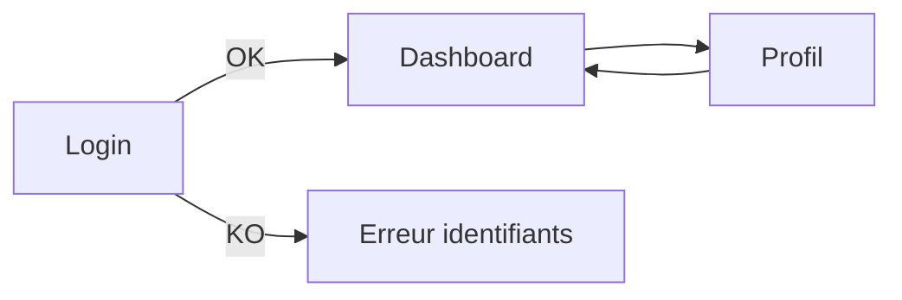

# Todo S5 - Écrans + parcours utilisateur (fiche + mini TP + exemple Cassandre)

## Fiche de cours (S5)

Maquetter, ce n’est pas “faire joli”. C’est rendre visible le fonctionnement: quels écrans existent, comment on passe de l’un à l’autre, et comment l’application réagit en cas d’erreur. Une maquette low-fi (simple) suffit pour valider la logique.

On définit d’abord le **parcours utilisateur** (le chemin). Ensuite on dessine les écrans principaux. On pense aussi aux états:

* état vide (pas de données)
* chargement
* erreur (message clair, action possible)

### Encadré vocabulaire

* **Wireframe**: maquette simple sans design final.
* **Parcours**: enchaînement d’écrans pour accomplir un objectif.
* **État**: variante d’un écran (vide/chargement/erreur).

## Mini TP (S5)

Objectif: produire un parcours + 4 écrans.

1. On choisit un scénario (ex: “se connecter”).

2. On liste les écrans nécessaires (login, dashboard, profil, erreur).

3. On maquette rapidement (Figma ou PlantUML) avec:
   
   * champs, boutons, messages
   * navigation (liens entre écrans)

4. On livre:
   
   * 1 schéma de parcours
   * 4 wireframes

## Exemple Cassandre (S5)

Parcours “authentification”:

* Login -> Dashboard
* Login -> Erreur identifiants
* Dashboard -> Profil

